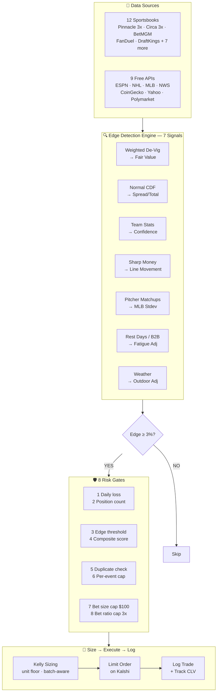

# Edge-Radar

**Automated Edge Detection & Execution for Prediction Markets**

[](https://kalshi.com)
[](https://python.org)
[](docs/ARCHITECTURE.md)
[](#-supported-markets)
[](#-edge-detection)
[](#%EF%B8%8F-risk--position-sizing)
[](#-documentation)
[](#-data-sources)

<p align="center">
  
</p>

> Scans thousands of Kalshi markets, cross-references 12 sportsbooks + 9 free APIs (including Polymarket, MLB pitcher stats, and ESPN rest data), identifies mispriced contracts with a normal CDF probability model, sizes bets with Kelly criterion, enforces 8 risk gates, and executes limit orders — logging every decision with fill-accurate accounting for closing line value tracking.

---

## 📊 Supported Markets

| 🏀 Sports Betting | 🏆 Championships | 🔮 Prediction Markets |
| --- | --- | --- |
| NFL, NBA, and MLB | NFL Super Bowl | Cryptocurrency |
| NCAAB & NCAAF | NBA Finals | US Stock Market |
| UFC and Boxing | NHL Stanley Cup | Politics |
| NHL and Soccer | MLB World Series | Weather |
| Golf & NASCAR | PGA Tour | TV and Pop Culture |

---

## ⚡ Edge Detection

|  | Feature | Description |
| --- | --- | --- |
| 📐 | **Normal CDF Model** | Spread/total probabilities via bell curve with sport-specific stdev |
| ⚖️ | **Sharp Book Weighting** | Pinnacle 3x, DraftKings 0.7x — sharp lines pull consensus |
| 📈 | **Team Stats** | ESPN/NHL/MLB win% validates or challenges book fair value |
| 💰 | **Sharp Money** | ESPN open-vs-close odds detect reverse line movement |
| 🌧️ | **Weather** | NWS forecasts for 61 NFL/MLB venues adjust total expectations |
| ⚾ | **Pitcher Matchups** | MLB Stats API: ERA, FIP, WHIP, K/9, rest — adjusts total stdev |
| 🔄 | **Rest Days** | ESPN B2B detection for NBA/NHL — fatigue adjusts stdev + confidence |
| ⚠️ | **Book Disagreement** | >4pt spread range across books flags injury news |
| 📊 | **CLV Tracking** | Closing line value validates model accuracy over time |

> [!IMPORTANT]
> Every scan defaults to **preview mode**. No money is risked until you pass `--execute`.

---

## 🛡️ Risk & Position Sizing

### Batch-Aware Kelly Sizing

Bet size scales with edge strength, divided by the number of simultaneous bets so total batch exposure stays controlled. Higher-edge opportunities get more capital; marginal edges stay at the minimum unit.

```
bet_size = max(unit_size, (KELLY_FRACTION / batch_size) × edge × bankroll)
```

When placing 5 bets at once with `KELLY_FRACTION=0.50`, each bet gets `0.50/5 = 0.10` of the Kelly fraction — keeping total exposure roughly equal to what a single full-fraction bet would be.

| Edge | Bankroll $50 | 1 bet (0.50) | 5 bets (0.50/5) | 10 bets (0.50/10) |
| --- | --- | --- | --- | --- |
| 3% | $0.75 | 2 contracts | 1 contract | 1 contract |
| 10% | $2.50 | 6 contracts | 2 contracts | 1 contract |
| 15% | $3.75 | 9 contracts | 2 contracts | 1 contract |
| 25% | $6.25 | 16 contracts | 4 contracts | 2 contracts |

The result is capped by max bet size ($100) and available balance. `KELLY_FRACTION` is configurable in `.env` (default: 0.25).

### 8 Risk Gates

Every order must pass gates 1-6. Gates 7-8 are sizing caps that downsize the order rather than rejecting it.

|  | Gate | Behavior |
| --- | --- | --- |
| 1 | **Daily loss limit** | Reject — no new bets after -$250 today |
| 2 | **Position count** | Reject — max 50 concurrent open positions |
| 3 | **Edge threshold** | Reject — minimum 3% edge required |
| 4 | **Composite score** | Reject — must score 6.0+ across edge, confidence, liquidity |
| 5 | **Duplicate check** | Reject — can't double up on the same market |
| 6 | **Per-event cap** | Reject — max 2 positions on the same game |
| 7 | **Bet size cap** | Cap — downsize to $100 |
| 8 | **Bet ratio cap** | Cap — no single bet exceeds 3x the batch median cost |

All limits are configurable via `.env`. See [Architecture](docs/ARCHITECTURE.md) for details on how scoring, confidence, and sizing interact.

---

## 🚀 Quick Start

> **New here?** See the full **[Setup Guide](docs/setup/SETUP_GUIDE.md)** for step-by-step instructions on API keys, private key generation, environment configuration, and your first scan.

```bash
# 1. Install and configure
pip install -r requirements.txt
cp .env.example .env  # See setup guide for API key instructions

# 2. Verify everything works
python scripts/doctor.py

# 3. Scan for opportunities (preview only)
python scripts/scan.py sports --filter nba

# 4. Execute after reviewing
python scripts/scan.py sports --filter nba --execute --unit-size 1 --max-bets 5

# 5. Settle and check P&L
python scripts/kalshi/kalshi_settler.py report --detail --save
```

> [!TIP]
> All scanners share the same flags: `--execute`, `--unit-size`, `--max-bets`, `--pick`, `--ticker`, `--save`, `--date`, `--exclude-open`. Use `--date tomorrow --exclude-open` to avoid double-betting.

<details>
<summary><b>More Examples</b></summary>

**Sports Betting**

```bash
# Scan any sport directly
python scripts/scan.py sports --filter nhl
python scripts/scan.py sports --filter mlb
python scripts/scan.py sports --filter ncaamb

# Execute with custom sizing
python scripts/scan.py sports --filter mlb --execute --unit-size 1 --max-bets 10

# Tomorrow's games only, skip games you already bet on
python scripts/scan.py sports --filter mlb --date tomorrow --exclude-open

# Save scan results to watchlist
python scripts/scan.py sports --filter nba --save
```

**Championship Futures**

```bash
# Scan futures markets
python scripts/scan.py futures --filter nba-futures
python scripts/scan.py futures --filter nhl-futures

# Execute futures picks
python scripts/scan.py futures --filter mlb-futures --execute --unit-size 2 --max-bets 5

# Save futures scan to watchlist
python scripts/scan.py futures --filter nba-futures --save
```

**Prediction Markets**

```bash
# Scan by category
python scripts/scan.py prediction --filter crypto
python scripts/scan.py prediction --filter weather
python scripts/scan.py prediction --filter spx

# Execute with sizing
python scripts/scan.py prediction --filter crypto --execute --unit-size 1 --max-bets 5

# Cross-reference against Polymarket
python scripts/scan.py prediction --filter crypto --cross-ref
```

**Polymarket Cross-Reference**

```bash
# Scan for cross-market edges
python scripts/scan.py polymarket
python scripts/scan.py polymarket --filter crypto

# Execute Polymarket-validated picks
python scripts/scan.py polymarket --execute --unit-size 1 --max-bets 5

# Save results and find matches
python scripts/scan.py polymarket --save
python scripts/polymarket/polymarket_edge.py match KXBTC-28MAR26-T88000
```

**Portfolio Management**

```bash
# Check portfolio status & open positions
python scripts/kalshi/kalshi_executor.py status

# Save status as markdown report
python scripts/kalshi/kalshi_executor.py status --save

# Risk dashboard (full or filtered)
python scripts/kalshi/risk_check.py
python scripts/kalshi/risk_check.py --report positions
python scripts/kalshi/risk_check.py --save

# Settle completed bets and update P&L
python scripts/kalshi/kalshi_settler.py settle

# Full performance report (saves markdown to reports/Accounts/Kalshi/)
python scripts/kalshi/kalshi_settler.py report --detail --save
```

</details>

---

## 🤖 Claude Code Skill

Edge-Radar includes a built-in `/edge-radar` slash command for [Claude Code](https://claude.ai/claude-code) that provides a natural language interface to the entire system. Type `/edge-radar` followed by what you want to do:

```
/edge-radar status                          # Balance, open positions, P&L
/edge-radar scan nba                        # Preview NBA opportunities
/edge-radar bet mlb --unit-size 1           # Scan MLB + execute on confirm
/edge-radar settle                          # Settle bets + P&L report
/edge-radar risk                            # Full risk dashboard
/edge-radar detail KXNBAGAME-26APR01-...    # Deep dive on a single market
/edge-radar crypto --cross-ref              # Prediction markets + Polymarket xref
```

The skill routes natural language to the correct scanner, enforces all risk gates, and always previews before executing. All flags (`--date`, `--exclude-open`, `--pick`, `--save`, etc.) work inline. Or just describe what you want in plain English — Claude handles the routing.

> [!NOTE]
> Requires [Claude Code](https://claude.ai/claude-code) CLI, Desktop, or IDE extension. The skill is defined in `.claude/skills/edge-radar/SKILL.md`.
>
> **Using Gemini CLI or OpenAI Codex?** The `/edge-radar` slash command is Claude Code-specific, but the commands and workflows are the same. Add the skill content from `.claude/skills/edge-radar/SKILL.md` to your `GEMINI.md` or `AGENTS.md` file to get equivalent functionality in those tools.

---

## 🔄 Automated Daily Execution

Pre-built scripts scan NFL, NBA, NHL, and MLB in a single command, rank the top 10 opportunities across all sports by composite score, and execute with Kelly sizing. See the **[Automation Guide](docs/setup/AUTOMATION_GUIDE.md)** for the full setup walkthrough.

```bash
# Preview today's best picks (no bets placed)
scripts\schedulers\same_day_executions\same_day_scan.bat

# Scan + execute (places live orders via Kalshi API)
scripts\schedulers\same_day_executions\same_day_execute.bat
```

### Quick Setup with Task Scheduler

```powershell
# Install morning execution (8 AM) + nightly settlement (11 PM)
python scripts/schedulers/automation/install_windows_task.py install execute
python scripts/schedulers/automation/install_windows_task.py install settle

# Check task status
python scripts/schedulers/automation/install_windows_task.py status

# Or install all four tasks at once (scan, execute, settle, next-day)
python scripts/schedulers/automation/install_windows_task.py install all
```

| Task | Schedule | Description |
| --- | --- | --- |
| `scan` | 8:00 AM | Preview scan — saves report, no bets |
| `execute` | 8:00 AM | Scan + execute — places live orders |
| `settle` | 11:00 PM | Settle bets, update P&L |
| `next-day` | 9:00 PM | Scan + execute tomorrow's games |

Reports save to `reports/Sports/schedulers/` with full execution details (Sport, Bet, Type, Pick, Qty, Price, Cost, Edge).

---

## 🏗️ How It Works



**Project Structure**

```
Edge-Radar/
├── scripts/
│   ├── scan.py              # Unified entry point → sports/futures/prediction/polymarket
│   ├── kalshi/              # Scan ── Size ── Execute ── Settle
│   ├── prediction/          # Crypto, weather, S&P, politics edge
│   ├── polymarket/          # Polymarket cross-reference edge detection
│   ├── shared/              # Config, team stats, weather, ticker display
│   └── schedulers/          # Automation & scheduled scan jobs
│       ├── morning_scans/   # Per-sport .bat scan jobs (MLB, NBA, NFL, NHL)
│       └── automation/      # Python scripts (daily scan, Windows Task Scheduler)
├── tests/                   # 100 pytest tests (risk gates, fill accounting, edge math, weather)
├── docs/                    # 8 guides (see Documentation below)
├── data/                    # Trade history, settlements, watchlists
├── reports/                 # Markdown scan reports + P&L reports
└── .claude/                 # Agents, skills, memory
```

---

## 📖 Documentation

| Guide | Description |
| --- | --- |
| **[Setup Guide](docs/setup/SETUP_GUIDE.md)** | API keys, private keys, environment config, first scan |
| **[Automation Guide](docs/setup/AUTOMATION_GUIDE.md)** | Windows Task Scheduler setup for automated daily betting |
| **[Scripts Reference](docs/SCRIPTS_REFERENCE.md)** | Every script, flag, and example |
| **[Sports Guide](docs/kalshi-sports-betting/SPORTS_GUIDE.md)** | 27 filters, edge detection, daily workflow |
| **[Futures Guide](docs/kalshi-futures-betting/FUTURES_GUIDE.md)** | NFL, NBA, NHL, MLB, golf championships |
| **[Prediction Markets](docs/kalshi-prediction-betting/PREDICTION_MARKETS_GUIDE.md)** | Crypto, weather, S&P 500, politics |
| **[Architecture](docs/ARCHITECTURE.md)** | Pipeline, risk gates, data flow |
| **[MLB Filtering](docs/kalshi-sports-betting/MLB_FILTERING_GUIDE.md)** | 10 filter categories for MLB picks |
| **[Web Dashboard](docs/web-app/SETUP.md)** | Streamlit dashboard setup, usage, and architecture |
| **[Roadmap](docs/enhancements/ROADMAP.md)** | All enhancements — edge model, project quality, pending |
| **[Changelog](docs/CHANGELOG.md)** | Full project history |

---

## 🔌 Data Sources

All external data is **free**. Only Kalshi requires a funded account.

| API | What It Provides |
| --- | --- |
| **[Kalshi](https://kalshi.com)** | Market data, order execution (API key + RSA signing) |
| **[The Odds API](https://the-odds-api.com)** | Sportsbook odds from 12 US books (500 free req/mo) |
| **[ESPN](http://site.api.espn.com)** | NBA, NFL, NCAAB, NCAAF standings + open/close odds |
| **[NHL Stats API](https://api-web.nhle.com)** | Standings, goal differential, last 10 record |
| **[MLB Stats API](https://statsapi.mlb.com)** | Standings, run differential, winning percentage |
| **[NWS](https://weather.gov)** | Hourly forecasts for 61 NFL/MLB outdoor venues |
| **[CoinGecko](https://coingecko.com)** | Crypto prices and 24-hour volatility |
| **[Yahoo Finance](https://finance.yahoo.com)** | S&P 500 price and VIX implied volatility |
| **[Polymarket](https://polymarket.com)** | Cross-market price reference via Gamma API (free, no key) |

---

[](#top)
