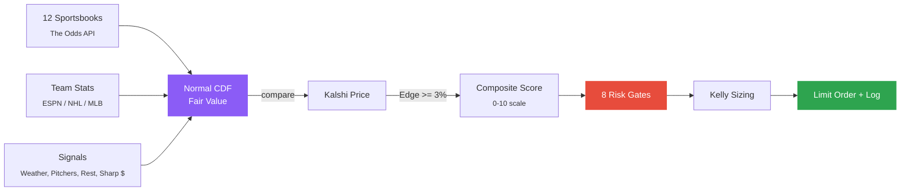

# Edge-Radar

**Automated Edge Detection & Execution for Prediction Markets**

[](https://kalshi.com)
[](https://python.org)
[](docs/ARCHITECTURE.md)
[](#-supported-markets)
[](#-edge-detection)
[](#%EF%B8%8F-risk--position-sizing)
[](#-documentation)
[](#-data-sources)
[](docs/web-app/LOCAL.md)

<p align="center">
  
</p>

> Scans thousands of Kalshi markets, cross-references 12 sportsbooks + 9 free APIs (including Polymarket, MLB pitcher stats, and ESPN rest data), identifies mispriced contracts with a normal CDF probability model, sizes bets with Kelly criterion, enforces 8 risk gates, and executes limit orders — logging every decision with fill-accurate accounting for closing line value tracking.

---

<br>

## Supported Markets

<table>
<tr>
<td width="33%" valign="top">

#### Sports Betting
NFL | NBA | MLB | NHL | NCAAB | NCAAF | UFC | Boxing | Soccer | MLS | F1 | NASCAR | PGA | IPL | Esports
<br><sub>27 sport filters via The Odds API</sub>

</td>
<td width="33%" valign="top">

#### Championship Futures
Super Bowl | NBA Finals | Stanley Cup | World Series | PGA Tour
<br><sub>Season-long markets cross-referenced against sportsbook futures</sub>

</td>
<td width="33%" valign="top">

#### Prediction Markets
Crypto | S&P 500 | Weather | Politics | Pop Culture
<br><sub>CoinGecko, Yahoo Finance, NWS, Polymarket cross-ref</sub>

</td>
</tr>
</table>

---

## Edge Detection Pipeline



<table>
<tr>
<td width="50%">

| Signal | Source |
|:-------|:-------|
| **Normal CDF Model** | Sport-specific stdev bell curve probabilities |
| **Sharp Book Weighting** | Pinnacle 3x, Circa 3x, DraftKings 0.7x |
| **Team Stats** | ESPN/NHL/MLB win% validates fair value |
| **Sharp Money** | Open-vs-close odds detect reverse line movement |

</td>
<td width="50%">

| Signal | Source |
|:-------|:-------|
| **Weather** | NWS forecasts for 61 NFL/MLB outdoor venues |
| **Pitcher Matchups** | ERA, FIP, WHIP, K/9, rest days from MLB Stats API |
| **Rest Days** | NBA/NHL back-to-back fatigue detection |
| **Book Disagreement** | >4pt spread range flags injury news |

</td>
</tr>
</table>

> [!IMPORTANT]
> Every scan defaults to **preview mode**. No money is risked until you pass `--execute`.

---

## Risk & Position Sizing

<table>
<tr>
<td width="55%" valign="top">

#### 8 Risk Gates

Every order must clear gates 1-6. Gates 7-8 cap sizing instead of rejecting.

| # | Gate | Action |
|:-:|:-----|:-------|
| 1 | Daily loss limit | Reject at -$250 |
| 2 | Position count | Reject at 50 open |
| 3 | Edge threshold | Reject below 3% |
| 4 | Composite score | Reject below 6.0/10 |
| 5 | Duplicate check | Reject same market |
| 6 | Per-event cap | Reject at 2/game |
| 7 | Bet size cap | Cap at $100 |
| 8 | Bet ratio cap | Cap at 3x batch median |

<sub>All limits configurable via <code>.env</code> &mdash; see <a href="docs/ARCHITECTURE.md">Architecture</a></sub>

</td>
<td width="45%" valign="top">

#### Batch-Aware Kelly Sizing

Bet size scales with edge, divided by batch count to control total exposure.

```
bet = max(unit, (kelly_frac / batch) * edge * bankroll)
```

| Edge | 1 bet | 5 bets | 10 bets |
|:-----|------:|-------:|--------:|
| 3% | $0.75 | $0.15 | $0.08 |
| 10% | $2.50 | $0.50 | $0.25 |
| 15% | $3.75 | $0.75 | $0.38 |
| 25% | $6.25 | $1.25 | $0.63 |

<sub>Example: $50 bankroll, <code>KELLY_FRACTION=0.50</code>. Capped by max bet ($100) and balance.</sub>

</td>
</tr>
</table>

---

## Quick Start

```bash
# 1. Install and configure
pip install -r requirements.txt && cp .env.example .env

# 2. Verify environment (API keys, dependencies)
python scripts/doctor.py

# 3. Preview opportunities (no money risked)
python scripts/scan.py sports --filter nba

# 4. Execute with risk controls
python scripts/scan.py sports --filter nba --execute --unit-size 1 --max-bets 5

# 5. Settle bets and view P&L
python scripts/kalshi/kalshi_settler.py report --detail --save
```

> [!TIP]
> All scanners share the same flags: `--execute`, `--unit-size`, `--max-bets`, `--pick`, `--ticker`, `--save`, `--date`, `--exclude-open`. Use `--date tomorrow --exclude-open` to avoid double-betting.

> **First time?** See the full **[Setup Guide](docs/setup/SETUP_GUIDE.md)** for API keys, RSA private key generation, and environment configuration.

<details>
<summary><b>Sports Betting</b></summary>

```bash
python scripts/scan.py sports --filter nhl
python scripts/scan.py sports --filter mlb --execute --unit-size 1 --max-bets 10
python scripts/scan.py sports --filter mlb --date tomorrow --exclude-open
python scripts/scan.py sports --filter nba --save
```
</details>

<details>
<summary><b>Championship Futures</b></summary>

```bash
python scripts/scan.py futures --filter nba-futures
python scripts/scan.py futures --filter mlb-futures --execute --unit-size 2 --max-bets 5
python scripts/scan.py futures --filter nba-futures --save
```
</details>

<details>
<summary><b>Prediction Markets</b></summary>

```bash
python scripts/scan.py prediction --filter crypto
python scripts/scan.py prediction --filter weather
python scripts/scan.py prediction --filter crypto --execute --unit-size 1 --max-bets 5
python scripts/scan.py prediction --filter crypto --cross-ref
```
</details>

<details>
<summary><b>Polymarket Cross-Reference</b></summary>

```bash
python scripts/scan.py polymarket --filter crypto
python scripts/scan.py polymarket --execute --unit-size 1 --max-bets 5
python scripts/polymarket/polymarket_edge.py match KXBTC-28MAR26-T88000
```
</details>

<details>
<summary><b>Portfolio & Settlement</b></summary>

```bash
python scripts/kalshi/kalshi_executor.py status --save
python scripts/kalshi/risk_check.py --report positions --save
python scripts/kalshi/kalshi_settler.py settle
python scripts/kalshi/kalshi_settler.py report --detail --save
```
</details>

<details>
<summary><b>Backtesting</b></summary>

```bash
python scripts/backtest/backtester.py
python scripts/backtest/backtester.py --simulate --save
python scripts/backtest/backtester.py --sport mlb --confidence high --min-edge 0.10
```
</details>

---

## Claude Code Integration

Edge-Radar includes a built-in `/edge-radar` slash command for [Claude Code](https://claude.ai/claude-code):

```
/edge-radar status                        # Balance, positions, P&L
/edge-radar scan nba                      # Preview NBA opportunities
/edge-radar bet mlb --unit-size 1         # Scan + execute on confirm
/edge-radar settle                        # Settle + P&L report
/edge-radar risk                          # Risk dashboard
/edge-radar crypto --cross-ref            # Prediction markets + Polymarket
```

Routes natural language to the correct scanner, enforces all risk gates, always previews before executing. All CLI flags work inline.

> [!NOTE]
> Requires [Claude Code](https://claude.ai/claude-code) CLI, Desktop, or IDE extension. Skill defined in `.claude/skills/edge-radar/SKILL.md`.
>
> **Gemini CLI / OpenAI Codex** — add the skill content to your `GEMINI.md` or `AGENTS.md` for equivalent functionality.

---

## Automated Daily Execution

Pre-built scripts scan all sports, rank by composite score, and execute with Kelly sizing. See the **[Automation Guide](docs/setup/AUTOMATION_GUIDE.md)**.

```powershell
# Install all scheduled tasks at once
python scripts/schedulers/automation/install_windows_task.py install all
```

| Task | Schedule | Description |
|:-----|:---------|:------------|
| `scan` | 8:00 AM ET | Preview scan — saves report, no bets |
| `execute` | 8:00 AM ET | Scan + execute — places live orders |
| `settle` | 11:00 PM ET | Settle bets, update P&L |
| `next-day` | 9:00 PM ET | Scan + execute tomorrow's games |

<sub>Reports save to <code>reports/Sports/schedulers/</code> with full execution details.</sub>

---

## Architecture

```
Edge-Radar/
├── scripts/
│   ├── scan.py                  # Unified entry point
│   ├── kalshi/                  # Scan → Size → Execute → Settle
│   ├── polymarket/              # Cross-market edge detection
│   ├── shared/                  # Team stats, weather, tickers, logging
│   └── schedulers/              # Automation & scheduled jobs
├── app/domain/                  # Typed domain objects
├── webapp/                      # Streamlit dashboard (deploy your own instance)
├── tests/                       # 150 pytest tests
├── docs/                        # 11 guides
├── data/                        # Trade history & watchlists (gitignored)
└── reports/                     # Scan & P&L reports (gitignored)
```

<details>
<summary><b>Backtesting Framework</b></summary>

Analyze settled trades for win rate, ROI, profit factor, Sharpe ratio, equity curves, max drawdown, and calibration data — broken down by sport, category, confidence level, and edge bucket.

| Metric | Description |
|:-------|:------------|
| **Win Rate** | Settled trades that won |
| **ROI** | Net P&L / total wagered |
| **Profit Factor** | Total wins / total losses |
| **Sharpe Ratio** | Risk-adjusted daily P&L return |
| **Max Drawdown** | Largest peak-to-trough decline |
| **Calibration** | Predicted vs. actual win rate by bucket |

The `--simulate` flag runs what-if scenarios across edge thresholds, confidence tiers, and categories. Use `--save` to export reports.

</details>

---

## Documentation

| Guide | Description |
|:------|:------------|
| **[Setup Guide](docs/setup/SETUP_GUIDE.md)** | API keys, environment config, first scan |
| **[Automation Guide](docs/setup/AUTOMATION_GUIDE.md)** | Windows Task Scheduler for daily betting |
| **[Scripts Reference](docs/SCRIPTS_REFERENCE.md)** | Every script, flag, and example |
| **[Sports Guide](docs/kalshi-sports-betting/SPORTS_GUIDE.md)** | 27 filters, edge detection, daily workflow |
| **[Futures Guide](docs/kalshi-futures-betting/FUTURES_GUIDE.md)** | NFL, NBA, NHL, MLB, golf championships |
| **[Prediction Markets](docs/kalshi-prediction-betting/PREDICTION_MARKETS_GUIDE.md)** | Crypto, weather, S&P 500, politics |
| **[Architecture](docs/ARCHITECTURE.md)** | Pipeline, risk gates, data flow |
| **[MLB Filtering](docs/kalshi-sports-betting/MLB_FILTERING_GUIDE.md)** | 10 filter categories for MLB picks |
| **[Web Dashboard](docs/web-app/LOCAL.md)** | Streamlit dashboard — local & cloud deployment guide |
| **[Roadmap](docs/enhancements/ROADMAP.md)** | All enhancements — completed & pending |
| **[Changelog](docs/CHANGELOG.md)** | Full project history |

---

## Data Sources

All external data is **free**. Only Kalshi requires a funded account.

| API | Purpose |
|:----|:--------|
| **[Kalshi](https://kalshi.com)** | Market data + order execution (API key + RSA signing) |
| **[The Odds API](https://the-odds-api.com)** | 12 US sportsbook odds (500 free req/mo) |
| **[ESPN](http://site.api.espn.com)** | NBA, NFL, NCAAB, NCAAF standings + line movement |
| **[NHL Stats API](https://api-web.nhle.com)** | Standings, goal differential, last 10 record |
| **[MLB Stats API](https://statsapi.mlb.com)** | Standings, run differential, pitcher stats |
| **[NWS](https://weather.gov)** | Hourly forecasts for 61 NFL/MLB outdoor venues |
| **[CoinGecko](https://coingecko.com)** | Crypto prices + 24h volatility |
| **[Yahoo Finance](https://finance.yahoo.com)** | S&P 500 + VIX implied volatility |
| **[Polymarket](https://polymarket.com)** | Cross-market price reference via Gamma API (free) |

---

<p align="center">
  <a href="docs/setup/SETUP_GUIDE.md">Setup</a>&nbsp;&nbsp;&bull;&nbsp;&nbsp;<a href="docs/ARCHITECTURE.md">Architecture</a>&nbsp;&nbsp;&bull;&nbsp;&nbsp;<a href="docs/SCRIPTS_REFERENCE.md">Scripts</a>&nbsp;&nbsp;&bull;&nbsp;&nbsp;<a href="docs/CHANGELOG.md">Changelog</a>
</p>

<p align="center">
  <sub>Built with Python, scipy, and too many API calls &mdash; <a href="#edge-radar">Back to top</a></sub>
</p>
