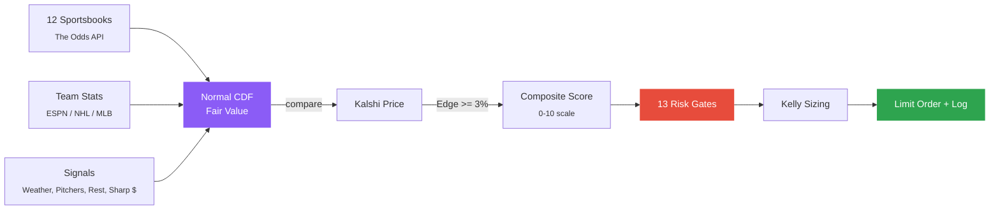

# Edge-Radar

**Automated Edge Detection & Execution for Prediction Markets**

[](https://kalshi.com)
[](https://python.org)
[](docs/ARCHITECTURE.md)
[](#-supported-markets)
[](#-edge-detection)
[](#%EF%B8%8F-risk--position-sizing)
[](#-documentation)
[](#-data-sources)
[](docs/web-app/LOCAL.md)
[](https://michaelschecht.github.io/Edge-Radar/)

<p align="center">
  
</p>

<p align="center">
  <a href="https://michaelschecht.github.io/Edge-Radar/"><b>▶ View the interactive data-flow diagram</b></a>
</p>

> Scans thousands of Kalshi markets, cross-references 12 sportsbooks + 9 free APIs (including Polymarket, MLB pitcher stats, and ESPN rest data), identifies mispriced contracts with a normal CDF probability model, sizes bets with Kelly criterion (soft-capped above 15% edge per calibration), enforces 13 risk gates including per-sport edge floors, a $0.10 lottery-ticket price floor, NO-side favorite guard, a prediction-market safety gate, and 48h series dedup, and executes limit orders — logging every decision with fill-accurate accounting for closing line value tracking.

---

<br>

## Supported Markets

<table>
<tr>
<td width="33%" valign="top">

#### 🏟️ Sports Betting

🏈 NFL · 🏀 NBA · ⚾ MLB · 🏒 NHL
🎓 NCAAB · NCAAF · 🥊 UFC · Boxing
⚽ Soccer · MLS · 🏎️ F1 · NASCAR
⛳ PGA · 🏏 IPL · 🎮 Esports

<sub><b>27 filters</b> · 18 sports with Odds API edge detection</sub>

</td>
<td width="33%" valign="top">

#### 🏆 Championship Futures

🏈 Super Bowl
🏀 NBA Finals
🏒 Stanley Cup
⚾ World Series
⛳ PGA Tour

<sub><b>N-way de-vig</b> · cross-referenced against sportsbook outrights</sub>

</td>
<td width="33%" valign="top">

#### 📈 Prediction Markets

₿ Crypto (BTC, ETH, XRP, SOL, DOGE)
📊 S&P 500 + VIX
🌡️ Weather (13 cities)
🗳️ Politics
🔗 Polymarket cross-ref

<sub><b>5 categories</b> · CoinGecko, Yahoo Finance, NWS, Gamma API</sub>

</td>
</tr>
</table>

---

## Edge Detection Pipeline

> 🔗 **[View the interactive version →](https://michaelschecht.github.io/Edge-Radar/)**



| Signal | Source |
|:-------|:-------|
| **Normal CDF Model** | Sport-specific stdev bell curve probabilities |
| **Sharp Book Weighting** | Pinnacle 3x, Circa 3x, DraftKings 0.7x |
| **Team Stats** | ESPN/NHL/MLB win% validates fair value |
| **Sharp Money** | Open-vs-close odds detect reverse line movement |
| **Weather** | NWS forecasts for 61 NFL/MLB outdoor venues |
| **Pitcher Matchups** | ERA, FIP, WHIP, K/9, rest days from MLB Stats API |
| **Rest Days** | NBA/NHL back-to-back fatigue detection |
| **Book Disagreement** | >4pt spread range flags injury news |

> [!IMPORTANT]
> Every scan defaults to **preview mode**. No money is risked until you pass `--execute`. Each scan row shows a **Gate** column (R18) that previews whether it will pass the static risk gates — `ok` if all clear, or a short label (`score`, `conf`, `no-fav`, `pred-off`, etc.) for the failing gate.

---

## Risk & Position Sizing

### 13 Risk Gates

Every order must clear gates 1-7 (including 3.5, 4.5, 4.6, 4.7). Gates 8-9 cap sizing instead of rejecting.

| # | Gate | Action |
|:-:|:-----|:-------|
| 1 | Daily loss limit | Reject at -$250 |
| 2 | Position count | Reject at 50 open |
| 3 | Edge threshold | Reject below floor (3% global; 12% NBA; 10% NCAAB) |
| 3.5 | Market price floor | Reject bets priced below `MIN_MARKET_PRICE` (default $0.10 — lottery-ticket filter) |
| 4 | Composite score | Reject below 6.0/10 |
| 4.5 | Min confidence | Reject below `MIN_CONFIDENCE` (default medium) |
| 4.6 | NO-side favorite | Reject NO bets <25¢ unless edge ≥25% AND confidence=high |
| 4.7 | Prediction-market safety | Reject crypto/weather/spx/mentions/companies/politics unless `ALLOW_PREDICTION_BETS=true` (R25) |
| 5 | Duplicate check | Reject same market |
| 6 | Per-event cap | Reject at 2/game |
| 7 | Series dedup | Reject same matchup bet within 48h |
| 8 | Bet size cap | Cap at $100 |
| 9 | Bet ratio cap | Cap at 3x batch median |

<sub>All limits configurable via <code>.env</code>. Gate 3.5 (<code>MIN_MARKET_PRICE</code>, R7) added 2026-04-22 — F10 from the 14-day review showed sub-10¢ bets at 1W-3L with the model claiming "+50% edge" on 8-10¢ longshots. Gate 4.5 (<code>MIN_CONFIDENCE</code>) and Gate 4.6 (<code>NO_SIDE_*</code>) added 2026-04-21 after low-confidence bets at -105% ROI and all 13 high-edge losers being NO-side on heavy favorites. NO bets below <code>NO_SIDE_KELLY_PRICE_FLOOR</code> (default 35¢) are additionally sized at half-Kelly. NBA floor bumped 0.08 → 0.12 in R14 (2026-04-24) after the 30-day calibration showed NBA Brier 0.3306 (worst of all sports). Confidence bumps now one-way (R13, 2026-04-24) — team stats, rest/B2B, and sharp-money signals can drop a tier but no longer bump up; upward bumps correlated with inflated claimed edge rather than better outcomes. Gate 4.7 (<code>ALLOW_PREDICTION_BETS</code>, R25) added 2026-04-24 after a prediction-market audit found all 6 modules (crypto/weather/spx/mentions/companies/politics) cache stale data with no TTL and produce nonsense fair values; the gate blocks those categories by default until the models are rebuilt. See <a href="docs/ARCHITECTURE.md">Architecture</a></sub>

### Batch-Aware Kelly Sizing

Bet size scales with edge, divided by batch count to control total exposure. Edge is soft-capped above 15% before sizing (`trusted_edge()`) to damp Kelly on likely-overstated signals — raw edge remains in gates and reports.

```
bet = max(unit, (kelly_frac / batch) * trusted_edge(edge) * bankroll)
```

| Edge | Trusted | 1 bet | 5 bets | 10 bets |
|:-----|:--------|------:|-------:|--------:|
| 3% | 3% | $0.75 | $0.15 | $0.08 |
| 10% | 10% | $2.50 | $0.50 | $0.25 |
| 15% | 15% | $3.75 | $0.75 | $0.38 |
| 25% | 20% | $5.00 | $1.00 | $0.50 |
| 35% | 25% | $6.25 | $1.25 | $0.63 |

<sub>Example: $50 bankroll, <code>KELLY_FRACTION=0.50</code>. Capped by max bet ($100) and balance. Soft-cap: <code>KELLY_EDGE_CAP=0.15</code>, <code>KELLY_EDGE_DECAY=0.5</code>.</sub>

---

## Quick Start

```bash
# 0. Clone repo and enter project
git clone https://github.com/michaelschecht/Edge-Radar.git
cd Edge-Radar

# 1. Create + activate virtual environment
python -m venv .venv
# macOS/Linux (bash/zsh):
source .venv/bin/activate
# Windows PowerShell:
# .venv\Scripts\Activate.ps1

# 2. Install dependencies and create env file
python -m pip install --upgrade pip
pip install -r requirements.txt
cp .env.example .env

# 3. Verify environment (API keys, dependencies)
python scripts/doctor.py

# 4. Preview opportunities (no money risked)
python scripts/scan.py sports --filter nba

# 5. Execute with risk controls
python scripts/scan.py sports --filter nba --execute --unit-size 1 --max-bets 5

# 6. Settle bets and view P&L
python scripts/kalshi/kalshi_settler.py report --detail --save
```

> [!TIP]
> All scanners share the same flags: `--execute`, `--unit-size`, `--max-bets`, `--pick`, `--ticker`, `--save`, `--date`, `--exclude-open`. Use `--date tomorrow --exclude-open` to avoid double-betting.

### Next Steps

| Guide | What it covers |
|:------|:---------------|
| **[Setup Guide](docs/setup/SETUP_GUIDE.md)** | First-time install, API keys + RSA private key generation, `.env` wiring, safe rollout plan (dry-run → low-stakes → normal), automation, ongoing monitoring, troubleshooting |
| **[Local Dashboard](docs/web-app/LOCAL.md)** | Run the Streamlit dashboard on your own machine at `http://localhost:8501` |
| **[Cloud Dashboard](docs/web-app/CLOUD.md)** | Deploy your own instance to Streamlit Community Cloud (free tier) |

### Command Recipes

Expand any section for copy-paste CLI examples by workflow.

<details>
<summary><b>Sports Betting</b></summary>

```bash
python scripts/scan.py sports --filter nhl
python scripts/scan.py sports --filter mlb --execute --unit-size 1 --max-bets 10
python scripts/scan.py sports --filter mlb --date tomorrow --exclude-open
python scripts/scan.py sports --filter nba --save
```
</details>

<details>
<summary><b>Championship Futures</b></summary>

```bash
python scripts/scan.py futures --filter nba-futures
python scripts/scan.py futures --filter mlb-futures --execute --unit-size 2 --max-bets 5
python scripts/scan.py futures --filter nba-futures --save
```
</details>

<details>
<summary><b>Prediction Markets</b></summary>

```bash
python scripts/scan.py prediction --filter crypto
python scripts/scan.py prediction --filter weather
python scripts/scan.py prediction --filter crypto --execute --unit-size 1 --max-bets 5
python scripts/scan.py prediction --filter crypto --cross-ref
```
</details>

<details>
<summary><b>Polymarket Cross-Reference</b></summary>

```bash
python scripts/scan.py polymarket --filter crypto
python scripts/scan.py polymarket --execute --unit-size 1 --max-bets 5
python scripts/polymarket/polymarket_edge.py match KXBTC-28MAR26-T88000
```
</details>

<details>
<summary><b>Portfolio & Settlement</b></summary>

```bash
python scripts/kalshi/kalshi_executor.py status --save
python scripts/kalshi/risk_check.py --report positions --save
python scripts/kalshi/kalshi_settler.py settle
python scripts/kalshi/kalshi_settler.py report --detail --save
```
</details>

<details>
<summary><b>Backtesting</b></summary>

```bash
python scripts/backtest/backtester.py
python scripts/backtest/backtester.py --simulate --save
python scripts/backtest/backtester.py --sport mlb --confidence high --min-edge 0.10
```
</details>

## Claude Code Integration

Edge-Radar ships with two slash commands for [Claude Code](https://claude.ai/claude-code):

| Skill | Definition | Description |
|:------|:-----------|:------------|
| [`/edge-radar`](.claude/skills/edge-radar/SKILL.md) | `.claude/skills/edge-radar/SKILL.md` | Unified command center — scan, bet, status, settle, risk, detail, backtest across Kalshi sports, futures, prediction markets, and Polymarket. |
| [`/edge-radar-analysis`](.claude/skills/edge-radar-analysis/SKILL.md) | `.claude/skills/edge-radar-analysis/SKILL.md` | Post-hoc performance report — trade ledger + slices by sport, category, side, edge bucket, confidence, price, calibration, longshots, streaks, daily P&L. |

```
/edge-radar status                        # Balance, positions, P&L
/edge-radar scan nba                      # Preview NBA opportunities
/edge-radar bet mlb --unit-size 1         # Scan + execute on confirm
/edge-radar settle                        # Settle + P&L report
/edge-radar-analysis 30 --save            # 30-day performance report to reports/Performance/
```

Routes natural language to the correct scanner, enforces all risk gates, always previews before executing. All CLI flags work inline.

> [!NOTE]
> Requires [Claude Code](https://claude.ai/claude-code) CLI, Desktop, or IDE extension.
>
> **Gemini CLI / OpenAI Codex** — add the skill content to your `GEMINI.md` or `AGENTS.md` for equivalent functionality.

---

## Automated Daily Execution

Pre-built scripts scan all sports, rank by composite score, and execute with Kelly sizing. See the **[Automation Guide](docs/setup/AUTOMATION_GUIDE.md)**.

```powershell
# Install all scheduled tasks at once
python scripts/schedulers/automation/install_windows_task.py install all
```

| Task | Schedule | Description |
|:-----|:---------|:------------|
| `scan` | 8:00 AM ET | Preview scan — saves report, no bets |
| `execute` | 8:00 AM ET | Scan + execute — places live orders |
| `settle` | 11:00 PM ET | Settle bets, update P&L |
| `next-day` | 9:00 PM ET | Scan + execute tomorrow's games |
| `calibration` | 2:00 AM, 1st of month | 30-day calibration report — Brier, calibration curve, prescriptive recommendations |

<sub>Reports save to <code>reports/Sports/schedulers/</code> with full execution details.</sub>

---

## Architecture

```
Edge-Radar/
├── .claude/                           # Claude Code config (skills, commands, settings)
│   ├── commands/                      # Slash-command definitions
│   ├── html/                          # Rendered interactive data-flow diagram
│   ├── images/                        # Logos and README assets
│   └── skills/                        # /edge-radar, /edge-radar-analysis
├── .devcontainer/                     # VS Code dev container spec
├── .github/
│   └── workflows/                     # CI/CD + Streamlit Cloud deploy
├── app/
│   └── domain/                        # Typed domain objects (Opportunity, RiskDecision, Execution*)
├── docs/                              # All public documentation
│   ├── kalshi-futures-betting/        # Championship futures guide
│   ├── kalshi-prediction-betting/     # Crypto, weather, S&P guides
│   ├── kalshi-sports-betting/         # 27 sport filters, MLB filtering, sports guide
│   ├── mcp-config/                    # MCP server reference
│   ├── scripts/                       # Per-script detailed docs
│   ├── setup/                         # SETUP_GUIDE.md, AUTOMATION_GUIDE.md
│   └── web-app/                       # LOCAL.md, CLOUD.md
├── prompts/                           # LLM prompts for analysis agents
│   ├── futures/
│   ├── polymarket/
│   ├── portfolio/
│   ├── predictions/
│   └── sports-betting/
├── scripts/
│   ├── backtest/                      # Equity curve, calibration, strategy simulation
│   ├── kalshi/                        # Scan → Size → Execute → Settle pipeline
│   ├── polymarket/                    # Cross-market edge detection
│   ├── prediction/                    # Crypto, weather, S&P 500 scanners
│   ├── shared/                        # Team stats, weather, tickers, logging, odds API
│   ├── scan.py                        # Unified entry point (routes to each scanner)
│   ├── doctor.py                      # Environment & credentials validator
│   └── bootstrap.py                   # Import-path setup for the venv .pth file
├── tests/                             # 150+ pytest tests (domain, edge detection, fills, risk)
└── webapp/                            # Streamlit dashboard
    └── views/                         # scan_page, portfolio_page, settle_page, backtest_page
```

<sub>Gitignored at the root (auto-created where needed): <code>data/</code> (trade history), <code>logs/</code>, <code>reports/</code> (scan + P&L reports), <code>keys/</code> (RSA private keys), <code>.venv/</code>, <code>repos/</code>.</sub>

<details>
<summary><b>Backtesting Framework</b></summary>

Analyze settled trades for win rate, ROI, profit factor, Sharpe ratio, equity curves, max drawdown, and calibration data — broken down by sport, category, confidence level, and edge bucket.

| Metric | Description |
|:-------|:------------|
| **Win Rate** | Settled trades that won |
| **ROI** | Net P&L / total wagered |
| **Profit Factor** | Total wins / total losses |
| **Sharpe Ratio** | Risk-adjusted daily P&L return |
| **Max Drawdown** | Largest peak-to-trough decline |
| **Calibration** | Predicted vs. actual win rate by bucket |

The `--simulate` flag runs what-if scenarios across edge thresholds, confidence tiers, and categories. Use `--save` to export reports.

</details>

---

## Documentation

| Guide | Description |
|:------|:------------|
| **[Setup Guide](docs/setup/SETUP_GUIDE.md)** | Install, API keys, `.env`, safe rollout, automation, and monitoring — the single end-to-end operator guide |
| **[Automation Guide](docs/setup/AUTOMATION_GUIDE.md)** | Windows Task Scheduler for daily betting |
| **[Scripts Reference](docs/SCRIPTS_REFERENCE.md)** | Every script, flag, and example |
| **[Sports Guide](docs/kalshi-sports-betting/SPORTS_GUIDE.md)** | 27 filters, edge detection, daily workflow |
| **[Futures Guide](docs/kalshi-futures-betting/FUTURES_GUIDE.md)** | NFL, NBA, NHL, MLB, golf championships |
| **[Prediction Markets](docs/kalshi-prediction-betting/PREDICTION_MARKETS_GUIDE.md)** | Crypto, weather, S&P 500, politics |
| **[Architecture](docs/ARCHITECTURE.md)** | Pipeline, risk gates, data flow |
| **[MLB Filtering](docs/kalshi-sports-betting/MLB_FILTERING_GUIDE.md)** | 10 filter categories for MLB picks |
| **[Local Dashboard](docs/web-app/LOCAL.md)** | Run the Streamlit dashboard on your machine |
| **[Cloud Dashboard](docs/web-app/CLOUD.md)** | Deploy your own instance to Streamlit Community Cloud |
| **[Roadmap](docs/enhancements/ROADMAP.md)** | All enhancements — completed & pending |
| **[Changelog](docs/CHANGELOG.md)** | Full project history |

---

## Data Sources

All external data is **free**. Only Kalshi requires a funded account.

| API | Purpose |
|:----|:--------|
| **[Kalshi](https://kalshi.com)** | Market data + order execution (API key + RSA signing) |
| **[The Odds API](https://the-odds-api.com)** | 12 US sportsbook odds (500 free req/mo) |
| **[ESPN](http://site.api.espn.com)** | NBA, NFL, NCAAB, NCAAF standings + line movement |
| **[NHL Stats API](https://api-web.nhle.com)** | Standings, goal differential, last 10 record |
| **[MLB Stats API](https://statsapi.mlb.com)** | Standings, run differential, pitcher stats |
| **[NWS](https://weather.gov)** | Hourly forecasts for 61 NFL/MLB outdoor venues |
| **[CoinGecko](https://coingecko.com)** | Crypto prices + 24h volatility |
| **[Yahoo Finance](https://finance.yahoo.com)** | S&P 500 + VIX implied volatility |
| **[Polymarket](https://polymarket.com)** | Cross-market price reference via Gamma API (free) |

---

<p align="center">
  <a href="docs/setup/SETUP_GUIDE.md">Setup</a>&nbsp;&nbsp;&bull;&nbsp;&nbsp;<a href="docs/ARCHITECTURE.md">Architecture</a>&nbsp;&nbsp;&bull;&nbsp;&nbsp;<a href="docs/SCRIPTS_REFERENCE.md">Scripts</a>&nbsp;&nbsp;&bull;&nbsp;&nbsp;<a href="docs/CHANGELOG.md">Changelog</a>
</p>

<p align="center">
  <sub>Built with Python, scipy, and too many API calls &mdash; <a href="#edge-radar">Back to top</a></sub>
</p>
