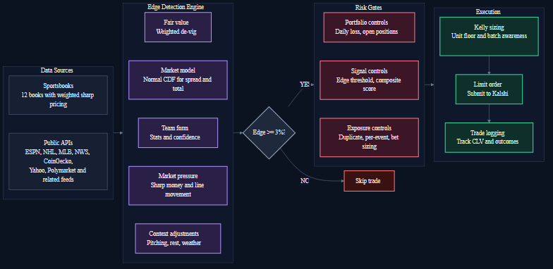

<div align="center">

# Edge-Radar

**Automated edge detection &amp; execution for prediction markets**

[](https://kalshi.com)
[](https://python.org)
[](#-markets)
[](#-risk--position-sizing)
[](#-data-sources)

</div>

> **Scans thousands of Kalshi markets, cross-references 12 sportsbooks and free data APIs, prices fair value with a normal-CDF model, and executes Kelly-sized limit orders** — every bet cleared through 13 risk gates and logged with fill-accurate accounting for closing-line-value tracking.

---

## 📊 Markets

| Category | Coverage | Data sources |
|:---------|:---------|:-------------|
| 🏟️ **Sports betting** | NFL, NBA, MLB, NHL, NCAAB/NCAAF, UFC, soccer/MLS, F1, NASCAR, PGA, IPL, esports — 27 filters across 18 sports | The Odds API (12 sportsbooks), ESPN, NHL/MLB Stats, NWS |
| 🏆 **Championship futures** | Super Bowl, NBA Finals, Stanley Cup, World Series, PGA Tour — priced with N-way de-vig | Sportsbook outright odds |
| 📈 **Prediction markets** | Crypto (BTC, ETH, XRP, SOL, DOGE), S&P 500 + VIX, weather (13 cities), politics | CoinGecko, Yahoo Finance, NWS |

---

## 🎯 Edge Detection Pipeline

<p align="center">
  
</p>

Fair value is a sport-specific normal-CDF model over a weighted-median consensus of 12 sportsbooks (sharp books like Pinnacle/Circa weighted 3×, recreational 0.7×), then adjusted by team-stats win%, sharp-money line movement, weather, pitcher matchups, rest/back-to-back fatigue, and book-disagreement signals. **[Sports Guide →](docs/kalshi/kalshi-sports-betting/SPORTS_GUIDE.md)** breaks down each signal and the de-vig math.

> [!IMPORTANT]
> Every scan defaults to **preview mode**. No money is risked until you pass `--execute`. Each scan row shows a **Gate** column (R18) that previews whether it will pass the static risk gates — `ok` if all clear, or a short label (`score`, `conf`, `no-fav`, `pred-off`, `live-off`, etc.) for the failing gate.

---

## 🚦 Risk & Position Sizing

### 13 Risk Gates

Every order must clear gates 1-7 (including 3.5, 4.5, 4.6, 4.7). Gates 8-9 cap sizing instead of rejecting.

| # | Gate | Action |
|:-:|:-----|:-------|
| 1 | Daily loss limit | Reject at -$250 |
| 2 | Position count | Reject at 50 open |
| 3 | Edge threshold | Reject below floor (3% global; 4% MLB/NBA/NCAAB) |
| 3.5 | Market price floor | Reject bets priced below `MIN_MARKET_PRICE` (default $0.06 — lottery-ticket filter) |
| 4 | Composite score | Reject below 6.0/10 |
| 4.5 | Min confidence | Reject below `MIN_CONFIDENCE` (default medium) |
| 4.6 | NO-side favorite | Reject NO bets <25¢ unless edge ≥25% AND confidence=high |
| 4.7 | Prediction-market safety | Reject crypto/weather/spx/mentions/companies/politics unless `ALLOW_PREDICTION_BETS=true` (R25) |
| 5 | Duplicate check | Reject same market |
| 6 | Per-event cap | Reject at 2/game |
| 7 | Series dedup | Reject same matchup bet within window (MLB/NHL 72h, others 48h; per-sport via `SERIES_DEDUP_HOURS_<SPORT>`) |
| 8 | Bet size cap | Cap at $100 |
| 9 | Bet ratio cap | Cap at 3x batch median |

<sub>All limits configurable via <code>.env</code>. Every gate traces to a documented calibration finding — the per-rule history (why the price floor, the NO-side guard, the per-sport edge floors, one-way confidence bumps, and the prediction-market block exist) lives in <a href="docs/setup/ARCHITECTURE.md">Architecture → Risk Management</a>.</sub>

### Batch-Aware Kelly Sizing

Bet size scales with edge, divided by batch count to control total exposure. Edge is soft-capped above 15% before sizing (`trusted_edge()`) to damp Kelly on likely-overstated signals — raw edge remains in gates and reports.

```
bet = max(unit, (kelly_frac / batch) * trusted_edge(edge) * bankroll)
```

Result is capped by max bet ($100), the bet-ratio cap, and available bankroll. <sub>**[Architecture → Position Sizing](docs/setup/ARCHITECTURE.md#-position-sizing)** has the full edge→contracts worked example and every `KELLY_*` knob.</sub>

---

## ⚡ Quick Start

```bash
# 0. Clone repo and enter project
git clone https://github.com/michaelschecht/Edge-Radar.git
cd Edge-Radar

# 1. Create + activate virtual environment
python -m venv .venv
# macOS/Linux (bash/zsh):
source .venv/bin/activate
# Windows PowerShell:
# .venv\Scripts\Activate.ps1

# 2. Install dependencies and create env file
python -m pip install --upgrade pip
pip install -r requirements.txt
cp .env.example .env

# 3. Verify environment (API keys, dependencies)
python scripts/doctor.py

# 4. Preview opportunities (no money risked)
python scripts/scan.py sports --filter nba

# 5. Execute with risk controls
python scripts/scan.py sports --filter nba --execute --unit-size 1 --max-bets 5

# 6. Settle bets and view P&L
python scripts/kalshi/kalshi_settler.py report --detail --save
```

> [!TIP]
> All scanners share the same flags: `--execute`, `--unit-size`, `--max-bets`, `--pick`, `--ticker`, `--save`, `--date`, `--exclude-open`. Use `--date tomorrow --exclude-open` to avoid double-betting.

### Next Steps

| Guide | What it covers |
|:------|:---------------|
| **[Setup Guide](docs/setup/SETUP_GUIDE.md)** | First-time install, API keys + RSA private key generation, `.env` wiring, safe rollout plan (dry-run → low-stakes → normal), automation, ongoing monitoring, troubleshooting |

### Command Recipes

Expand any section for copy-paste CLI examples by workflow.

<details>
<summary><b>Sports Betting</b></summary>

```bash
python scripts/scan.py sports --filter nhl
python scripts/scan.py sports --filter mlb --execute --unit-size 1 --max-bets 10
python scripts/scan.py sports --filter mlb --date tomorrow --exclude-open
python scripts/scan.py sports --filter nba --save
```
</details>

<details>
<summary><b>Championship Futures</b></summary>

```bash
python scripts/scan.py futures --filter nba-futures
python scripts/scan.py futures --filter mlb-futures --execute --unit-size 2 --max-bets 5
python scripts/scan.py futures --filter nba-futures --save
```
</details>

<details>
<summary><b>Prediction Markets</b></summary>

```bash
python scripts/scan.py prediction --filter crypto
python scripts/scan.py prediction --filter weather
python scripts/scan.py prediction --filter crypto --execute --unit-size 1 --max-bets 5
```
</details>

<details>
<summary><b>Portfolio & Settlement</b></summary>

```bash
python scripts/kalshi/kalshi_executor.py status --save
python scripts/kalshi/risk_check.py --report positions --save
python scripts/kalshi/kalshi_settler.py settle
python scripts/kalshi/kalshi_settler.py report --detail --save
```
</details>

<details>
<summary><b>Backtesting</b></summary>

```bash
python scripts/backtest/backtester.py
python scripts/backtest/backtester.py --simulate --save
python scripts/backtest/backtester.py --sport mlb --confidence high --min-edge 0.10
```

Analyzes settled trades for win rate, ROI, profit factor, Sharpe ratio, equity curves, max drawdown, and calibration — broken down by sport, category, confidence level, and edge bucket. The `--simulate` flag runs what-if scenarios across edge thresholds, confidence tiers, and categories; `--save` exports reports.
</details>

## 🤖 Claude Code Integration

Edge-Radar ships with two slash commands for [Claude Code](https://claude.ai/claude-code):

| Skill | Definition | Description |
|:------|:-----------|:------------|
| [`/edge-radar`](skills/edge-radar/SKILL.md) | `skills/edge-radar/SKILL.md` | Unified command center — scan, bet, status, settle, risk, detail, backtest across Kalshi sports, futures, and prediction markets. |
| [`/edge-radar-analysis`](skills/edge-radar-analysis/SKILL.md) | `skills/edge-radar-analysis/SKILL.md` | Post-hoc performance report — trade ledger + slices by sport, category, side, edge bucket, confidence, price, calibration, longshots, streaks, daily P&L. |

> The skill source of truth lives in [`skills/`](skills/). Claude Code loads them from `.claude/skills/`, which on Windows are directory junctions to `skills/` (git-ignored, since `core.symlinks=false`). After a fresh clone, recreate the junctions once: `pwsh -File scripts/setup/link_skills.ps1`.

Prefer copy-paste recipes over slash commands? The **[Prompt Library](prompts/README.md)** has 35 ready-to-use natural-language prompts — daily scans, execution sessions, live/prop betting, futures, portfolio routines, and backtesting — grouped by workflow.

```
/edge-radar status                        # Balance, positions, P&L
/edge-radar scan nba                      # Preview NBA opportunities
/edge-radar bet mlb --unit-size 1         # Scan + execute on confirm
/edge-radar settle                        # Settle + P&L report
/edge-radar-analysis 30 --save            # 30-day performance report to reports/Performance/
```

Routes natural language to the correct scanner, enforces all risk gates, always previews before executing. All CLI flags work inline.

> [!NOTE]
> Requires [Claude Code](https://claude.ai/claude-code) CLI, Desktop, or IDE extension.
>
> **Gemini CLI / OpenAI Codex** — add the skill content to your `GEMINI.md` or `AGENTS.md` for equivalent functionality.

---

## ⏰ Automated Daily Execution

Pre-built scripts scan all sports, rank by composite score, and execute with Kelly sizing. See the **[Automation Guide](docs/setup/AUTOMATION_GUIDE.md)**.

```powershell
# Install all scheduled tasks at once
python scripts/schedulers/automation/install_windows_task.py install all
```

| Task | Schedule | Description |
|:-----|:---------|:------------|
| `daily-summary` | 4:50 AM PT | Morning P&L digest — yesterday settled + open exposure + today pending + 7d context. Emailed at 5:00 AM PT (U2, 2026-04-30) |
| `scan` | 8:00 AM ET | Preview scan — saves report, no bets |
| `execute` | 8:00 AM ET | Scan + execute — places live orders |
| `settle` | 11:00 PM ET | Settle bets, update P&L |
| `next-day` | 9:00 PM ET | Scan + execute tomorrow's games |
| `calibration` | 2:00 AM, 1st of month | 30-day calibration report — Brier, calibration curve, prescriptive recommendations |

<sub>Reports save to <code>reports/Sports/schedulers/</code> with full execution details.</sub>

Want the **complete** pipeline — emails, midday/late runs, weekly calibration/backtest/analysis — beyond the installer's core tasks? See the **[owner's live task-schedule](docs/task-schedules/README.md)** — the full ~20-task roster the repo owner actually runs (documented as a recommended starting point), with copy-paste `.bat`/`.sh` templates and `schtasks` registration.

---

## 📖 Documentation

| Guide | Description |
|:------|:------------|
| **[Documentation Index](docs/README.md)** | Central index and map linking all guides, references, and specifications |
| **[Setup Guide](docs/setup/SETUP_GUIDE.md)** | Install, API keys, `.env`, safe rollout, automation, and monitoring — the single end-to-end operator guide |
| **[Automation Guide](docs/setup/AUTOMATION_GUIDE.md)** | Windows Task Scheduler for daily betting — one-command installer for the core tasks |
| **[Task Schedule (owner's live setup)](docs/task-schedules/README.md)** | The full ~20-task automation pipeline the repo owner runs — recommended template, with `.bat`/`.sh` templates and `schtasks` setup |
| **[Scripts Reference](docs/scripts/SCRIPTS_REFERENCE.md)** | Every script, flag, and example |
| **[Kalshi Coverage & Guides](docs/kalshi/README.md)** | Coverage matrix — which sports/markets are configured and what bet types |
| **[Sports Guide](docs/kalshi/kalshi-sports-betting/SPORTS_GUIDE.md)** | Edge detection model, consensus de-vig, daily workflow |
| **[Futures Guide](docs/kalshi/kalshi-futures-betting/FUTURES_GUIDE.md)** | NFL, NBA, NHL, MLB, golf championships |
| **[Prediction Markets](docs/kalshi/kalshi-prediction-betting/PREDICTION_MARKETS_GUIDE.md)** | Crypto, weather, S&P 500, politics |
| **[Architecture](docs/setup/ARCHITECTURE.md)** | Pipeline, edge models, risk gates, data flow, and project structure |
| **[MLB Filtering](docs/kalshi/kalshi-sports-betting/MLB_FILTERING_GUIDE.md)** | 10 filter categories for MLB picks |
| **[Roadmap](docs/enhancements/ROADMAP.md)** | All enhancements — completed & pending |
| **[Changelog](docs/CHANGELOG.md)** | Full project history |

---

## 🔌 Data Sources

All external data is **free**. Only Kalshi requires a funded account.

| API | Purpose |
|:----|:--------|
| **[Kalshi](https://kalshi.com)** | Market data + order execution (API key + RSA signing) |
| **[The Odds API](https://the-odds-api.com)** | 12 US sportsbook odds (500 free req/mo) |
| **[ESPN](http://site.api.espn.com)** | NBA, NFL, NCAAB, NCAAF standings + line movement |
| **[NHL Stats API](https://api-web.nhle.com)** | Standings, goal differential, last 10 record |
| **[MLB Stats API](https://statsapi.mlb.com)** | Standings, run differential, pitcher stats |
| **[NWS](https://weather.gov)** | Hourly forecasts for 61 NFL/MLB outdoor venues |
| **[CoinGecko](https://coingecko.com)** | Crypto prices + 24h volatility |
| **[Yahoo Finance](https://finance.yahoo.com)** | S&P 500 + VIX implied volatility |

---

<p align="center">
  <a href="docs/setup/SETUP_GUIDE.md">Setup</a>&nbsp;&nbsp;&bull;&nbsp;&nbsp;<a href="docs/setup/ARCHITECTURE.md">Architecture</a>&nbsp;&nbsp;&bull;&nbsp;&nbsp;<a href="docs/scripts/SCRIPTS_REFERENCE.md">Scripts</a>&nbsp;&nbsp;&bull;&nbsp;&nbsp;<a href="docs/CHANGELOG.md">Changelog</a>
</p>

<p align="center">
  <sub>Built with Python, scipy, and too many API calls &mdash; <a href="#edge-radar">Back to top</a></sub>
</p>
