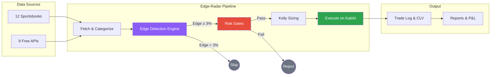
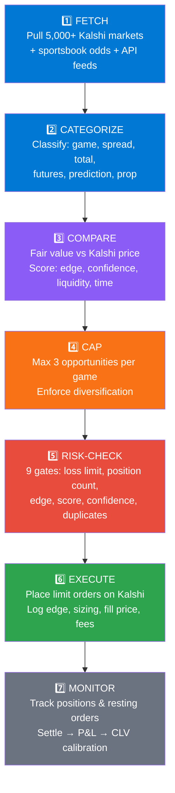
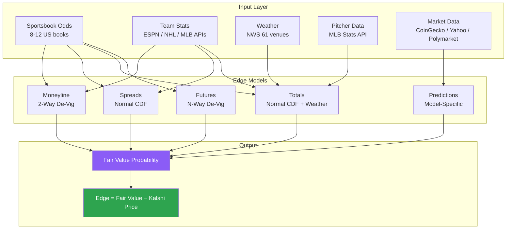
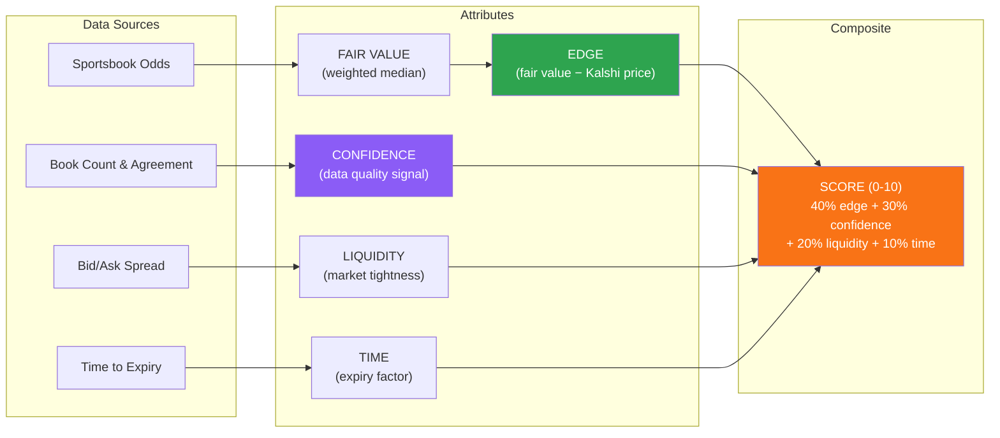
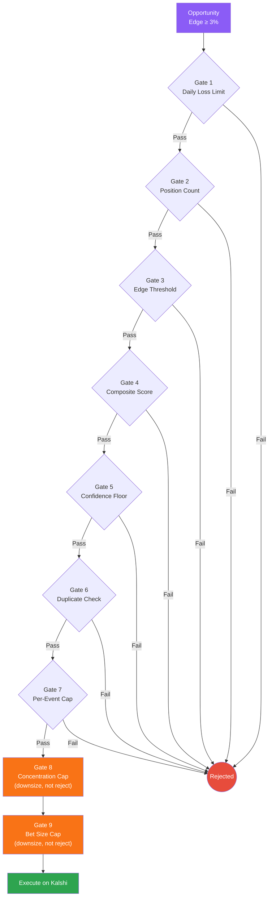
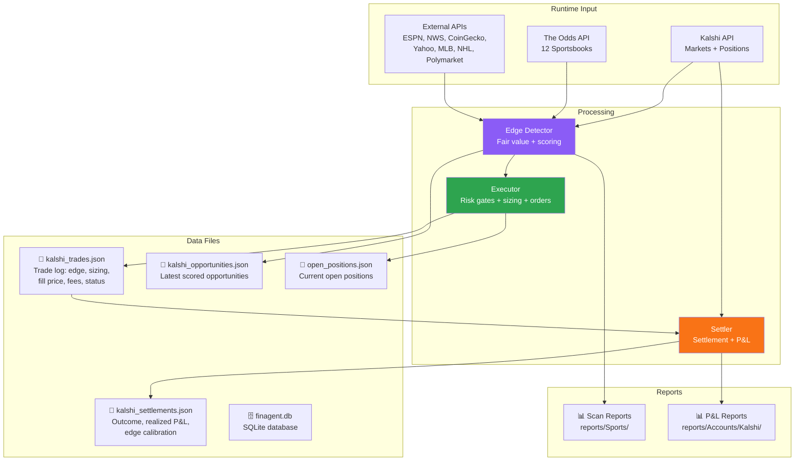

# Edge-Radar Architecture

**System Design, Edge Models, Risk Gates & Data Flow**

[](#-pipeline-overview)
[](#-edge-detection-models)
[](#%EF%B8%8F-risk-management)
[](#-how-scoring-works)
[](#-position-sizing)

---

## 🔭 System Overview

Edge-Radar is an automated edge-detection and execution pipeline for Kalshi prediction markets and sports betting. It scans thousands of open markets, cross-references prices against sportsbook consensus odds and external data models, identifies mispriced contracts, applies risk gates and position sizing, and executes limit orders — logging every decision for post-hoc calibration.



---

## 🔄 Pipeline Overview

The system processes every opportunity through seven sequential stages. Each stage either advances the opportunity or eliminates it.



| Stage | Action | Key Detail |
| :--- | :--- | :--- |
| **1. Fetch** | Pull all open Kalshi markets via API | Simultaneously fetch sportsbook odds + external data feeds |
| **2. Categorize** | Classify by type | Determines which edge model applies |
| **3. Compare** | Fair value vs. Kalshi ask price | Score on 4 dimensions: edge, confidence, liquidity, time |
| **4. Cap** | Limit to top 3 per game/event | Prevents concentration in a single contest |
| **5. Risk-Check** | 9 risk gates + Kelly sizing | Reject or cap — see [Risk Management](#%EF%B8%8F-risk-management) |
| **6. Execute** | Place limit orders on Kalshi | Full trade journal entry with rationale |
| **7. Monitor** | Track positions, settle, calibrate | Realized P&L + closing line value tracking |

---

## 🧠 Edge Detection Models

Each market type has a specialized edge model. All models produce the same output: a **fair value probability** that gets compared against the Kalshi ask price.



### Game Outcomes (Moneyline / 2-Way De-Vig)

Fetch head-to-head odds from 8-12 US sportsbooks. De-vig each book's line using the multiplicative method to extract true implied probability. Take the **weighted median** across all books — sharp books (Pinnacle, Circa) weighted 3x, recreational books (DraftKings, FanDuel) weighted 0.7x. Confidence factors in book count, estimate spread, and team stats signal.

### Spreads (Normal CDF Model)

Fetch spread lines from sportsbooks and compute weighted median spread and implied probability. Infer expected score margin using the book's line, then model the final margin as **Normal(mean, stdev)** with sport-specific standard deviations. Calculate `P(margin > strike)` via normal CDF.

| Sport | Standard Deviation | Notes |
| :--- | :--- | :--- |
| NBA | 12 | Higher variance, blowouts common |
| NCAAB | 11 | Similar to NBA, slightly tighter |
| NFL | 13.5 | Highest variance — field goals, turnovers |
| MLB | 3.5 | Low scoring, tight games |
| NHL | 2.5 | Lowest variance sport |

### Totals (Normal CDF + Weather)

Same CDF approach as spreads for expected total. For NFL and MLB outdoor games, a **weather adjustment** is applied via NWS hourly forecasts:

| Condition | Impact | Adjustment |
| :--- | :--- | :--- |
| Wind > 15 mph | Reduces scoring | Over fair value decreased |
| Rain > 40% | Reduces scoring | Over fair value decreased |
| Extreme cold | Reduces scoring | Over fair value decreased |
| Dome stadium | No weather effect | Auto-excluded from adjustments |

### Futures (N-Way De-Vig)

For championship and season-long markets with N outcomes, de-vig the full N-way market from sportsbook futures odds. Distribute the overround proportionally. Take weighted median across books.

### Predictions (Model-Specific)

| Market Type | Data Source | Method |
| :--- | :--- | :--- |
| Crypto (BTC, ETH, XRP, DOGE, SOL) | CoinGecko | Current price + 24h volatility vs. Kalshi strike; log-normal distribution |
| Weather (13 US cities) | NWS / NOAA | Ensemble forecast temperature distributions vs. Kalshi strike thresholds |
| S&P 500 | Yahoo Finance + VIX | Current level + implied volatility → probability of reaching strike by expiry |
| Cross-market | Polymarket Gamma API | Fuzzy-match Kalshi ↔ Polymarket; price discrepancy = edge signal |

---

## 📐 How Scoring Works

Four independent attributes are calculated for every opportunity. They build on each other but are derived from different data sources.



### Fair Value

The model's estimate of the true probability, derived purely from sportsbook odds:

1. Fetch odds from 8-12 US sportsbooks
2. De-vig each book's line (multiplicative method)
3. Take **weighted median** — sharp books 3x, recreational books 0.7x
4. For spreads/totals: apply **normal CDF** with sport-specific stdev

### Edge

How mispriced the Kalshi contract is — pure math, no judgment:

```
edge = fair_value - kalshi_ask_price
```

> [!TIP]
> A positive edge means Kalshi is underpricing the outcome relative to sportsbook consensus. Example: fair value = $0.74, Kalshi asks $0.61 → edge = **+13.3%**

### Confidence

How much to trust the fair value estimate. Derived from **data quality**, not edge size. A 30% edge with low confidence may be stale data; a 3% edge with high confidence is a real, durable signal.

**Base confidence** (from book consensus):

| Market Type | Low | Medium | High |
| :--- | :--- | :--- | :--- |
| Game (ML) | < 5 books | 5+ books | 8+ books AND fair range < 5% |
| Spread | < 3 books OR range > 4pts | 3+ books AND range ≤ 4pts | 6+ books AND range ≤ 2pts |
| Total | < 3 books | 3+ books | (via adjustments only) |

**Adjustments** (each can bump confidence up or down one level):
- **Team stats** — win%, L10, home/away from ESPN/NHL/MLB APIs
- **Sharp money / line movement** — ESPN open-vs-close odds; reverse line movement that agrees with our bet bumps up

### Score (Composite)

The final ranking — a single 0-10 number combining all signals:

| Component | Weight | Formula |
| :--- | :--- | :--- |
| Edge strength | 40% | `min(edge / 0.01, 10)` — linear, caps at 10% edge |
| Confidence | 30% | low = 3, medium = 6, high = 9 |
| Liquidity | 20% | `10 - (bid_ask_spread * 20)` — tighter = higher |
| Time | 10% | Fixed at 5 (placeholder) |

<details>
<summary><b>Scoring Example</b></summary>

A bet with 8% edge, high confidence, and tight spread:

| Component | Value | Weighted |
| :--- | :--- | :--- |
| Edge | min(8, 10) | × 0.40 = **3.2** |
| Confidence | 9 (high) | × 0.30 = **2.7** |
| Liquidity | 9.0 | × 0.20 = **1.8** |
| Time | 5 | × 0.10 = **0.5** |
| **Total** | | **8.2** |

The minimum score to pass risk checks is **6.0** (configurable via `MIN_COMPOSITE_SCORE`).

</details>

---

## 🛡️ Risk Management

### Risk Gate Pipeline

Every order must pass gates 1-7 before execution. Gates 8-9 are sizing caps that downsize the order rather than rejecting it.



| | Gate | Check | Behavior |
| :--- | :--- | :--- | :--- |
| 1 | **Daily loss limit** | Sum of realized losses today | **Reject** if losses ≥ `MAX_DAILY_LOSS` |
| 2 | **Position count** | Number of open positions | **Reject** if count ≥ `MAX_OPEN_POSITIONS` |
| 3 | **Edge threshold** | Calculated edge for this opportunity | **Reject** if edge < `MIN_EDGE_THRESHOLD` |
| 4 | **Composite score** | Weighted score (edge + confidence + liquidity + time) | **Reject** if score < `MIN_COMPOSITE_SCORE` |
| 5 | **Confidence level** | Model confidence rating | **Reject** if confidence < `MIN_CONFIDENCE` |
| 6 | **Duplicate ticker** | Already holding this exact market | **Reject** if ticker in open positions |
| 7 | **Per-event cap** | Too many positions on the same game | **Reject** if event count ≥ `MAX_PER_EVENT` |
| 8 | **Max concentration** | Single position exceeds % of bankroll | **Cap** — downsize to `MAX_CONCENTRATION` × bankroll |
| 9 | **Max bet size** | Category-aware bet size cap | **Cap** — downsize to `MAX_BET_SIZE_SPORTS` / `_PREDICTION` |

> [!NOTE]
> The trade log records approval subtypes for post-trade review:
> - `APPROVED` — passed all gates, no caps hit
> - `APPROVED_CAPPED_CONCENTRATION` — downsized by gate 8
> - `APPROVED_CAPPED_MAX_BET` — downsized by gate 9

### Risk Parameters

| Env Variable | Default | Description |
| :--- | :--- | :--- |
| `UNIT_SIZE` | $1.00 | Minimum dollar amount per bet (Kelly floor) |
| `KELLY_FRACTION` | 0.25 | Quarter-Kelly sizing multiplier |
| `MAX_BET_SIZE_SPORTS` | $50 | Maximum USD per sports bet |
| `MAX_BET_SIZE_PREDICTION` | $100 | Maximum USD per prediction market position |
| `MAX_DAILY_LOSS` | $250 | Hard stop — no new positions after this daily loss |
| `MAX_OPEN_POSITIONS` | 10 | Maximum concurrent open positions |
| `MAX_PER_EVENT` | 3 | Maximum positions on the same game/event |
| `MAX_POSITION_CONCENTRATION` | 20% | Maximum single position as % of bankroll |
| `MIN_EDGE_THRESHOLD` | 3% | Minimum edge required to consider a bet |
| `MIN_COMPOSITE_SCORE` | 6.0 | Minimum composite opportunity score |
| `MIN_CONFIDENCE` | medium | Minimum model confidence level |

---

## 💰 Position Sizing

Bets are sized using **batch-aware Kelly with a flat unit floor**. Kelly only scales up for high-edge opportunities — it never sizes below the minimum unit.

```
bet = max(unit_size, (KELLY_FRACTION / batch_size) × edge × bankroll)
```

When placing N bets simultaneously, each bet's Kelly fraction is divided by N. Total batch exposure stays proportional to what a single full-fraction bet would allocate.

| Ask Price | Edge | Flat Contracts | Kelly Contracts | Used | Actual Cost |
| :--- | :--- | :--- | :--- | :--- | :--- |
| $0.50 | 3% | 2 | 1 | 2 (flat) | $1.00 |
| $0.50 | 15% | 2 | 4 | 4 (Kelly) | $2.00 |
| $0.10 | 10% | 10 | 13 | 13 (Kelly) | $1.30 |
| $0.02 | 5% | 50 | 31 | 50 (flat) | $1.00 |

The result is capped by (in order): max concentration (20% of bankroll), max bet size ($50 sports / $100 prediction), and available bankroll. `KELLY_FRACTION` is configurable in `.env` (default: 0.25).

### Budget Cap (Batch-Level)

An optional `--budget` flag caps the **total cost of all bets in a batch**. When the sum exceeds the budget, every bet is proportionally scaled down. Each bet keeps at least 1 contract. Higher-edge bets retain proportionally more capital — Kelly's weighting is preserved.

```bash
# Cap total batch cost to 10% of bankroll
python scripts/scan.py sports --unit-size .5 --max-bets 5 --budget 10% --date today --exclude-open
```

> [!TIP]
> The budget accepts a percentage of bankroll (e.g., `--budget 10%`) or a flat dollar amount (e.g., `--budget 15`). When omitted, the pipeline behaves exactly as before. When the total is already under the budget, no scaling occurs.

---

## 📂 Data Flow



| File Path | Contents |
| :--- | :--- |
| `data/history/kalshi_trades.json` | Complete trade log: edge estimate, sizing, fill price, fees, status |
| `data/history/kalshi_settlements.json` | Settlement history with outcome, realized P&L, edge calibration |
| `data/watchlists/kalshi_opportunities.json` | Latest scored opportunities from the edge detector |
| `data/positions/open_positions.json` | Snapshot of current open positions |
| `data/finagent.db` | SQLite database (schema defined in `scripts/sql/init_db.sql`) |

---

## 🔮 Remaining Work

For the full enhancement roadmap (completed and pending items), see [ROADMAP.md](enhancements/ROADMAP.md).

| Priority | Enhancement | Status |
| :--- | :--- | :--- |
| 🔴 High | Backtesting framework — replay settled markets, calibration curve | Planned |
| 🟠 Medium | Bullpen availability tracker — high-value for MLB totals | Planned |
| 🟡 Normal | Injury impact scoring — ESPN injury reports, star player adjustments | Planned |
| 🟡 Normal | Wind direction classification — NWS bearing relative to stadium orientation | Planned |

---

<p align="center">

**[← Back to README](../README.md)** · **[Scripts Reference →](SCRIPTS_REFERENCE.md)** · **[Setup Guide →](setup/SETUP_GUIDE.md)**

</p>
