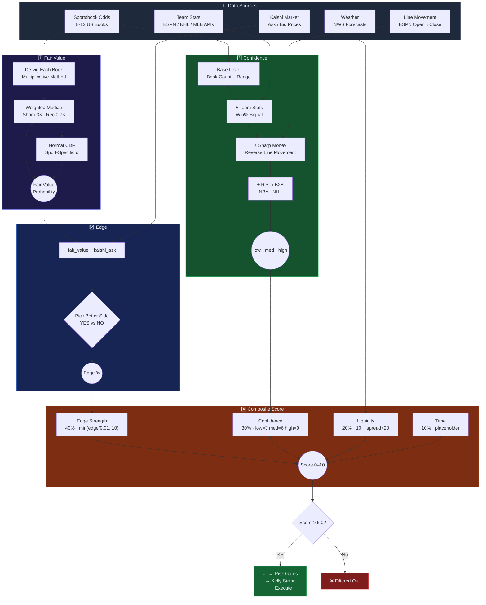

# Edge-Radar Architecture

**System Design, Edge Models, Risk Gates & Data Flow**

[](#-pipeline-overview)
[](#-edge-detection-models)
[](#%EF%B8%8F-risk-management)
[](#-how-scoring-works)
[](#-position-sizing)

> 🔗 **[View the interactive data-flow diagram →](https://michaelschecht.github.io/Edge-Radar/)**

---

## 🔭 System Overview

Edge-Radar is an automated edge-detection and execution pipeline for Kalshi prediction markets and sports betting. It scans thousands of open markets, cross-references prices against sportsbook consensus odds and external data models, identifies mispriced contracts, applies risk gates and position sizing, and executes limit orders — logging every decision for post-hoc calibration.

---

## 🔄 Pipeline Overview

The system processes every opportunity through seven sequential stages. Each stage either advances the opportunity or eliminates it.

| Stage | Action | Key Detail |
| :--- | :--- | :--- |
| **1. Fetch** | Pull all open Kalshi markets via API | Simultaneously fetch sportsbook odds + external data feeds |
| **2. Categorize** | Classify by type | Determines which edge model applies |
| **3. Compare** | Fair value vs. Kalshi ask price | Score on 4 dimensions: edge, confidence, liquidity, time |
| **4. Cap** | Limit to top 3 per game/event | Prevents concentration in a single contest |
| **5. Risk-Check** | 12 risk gates + Kelly sizing | Reject or cap — see [Risk Management](#%EF%B8%8F-risk-management) |
| **6. Execute** | Place limit orders on Kalshi | Full trade journal entry with rationale |
| **7. Monitor** | Track positions, settle, calibrate | Realized P&L + closing line value tracking |

---

## 🧠 Edge Detection Models

Each market type has a specialized edge model. All models produce the same output: a **fair value probability** that gets compared against the Kalshi ask price.

### Game Outcomes (Moneyline / 2-Way De-Vig)

Fetch head-to-head odds from 8-12 US sportsbooks. De-vig each book's line using the multiplicative method to extract true implied probability. Take the **weighted median** across all books — sharp books (Pinnacle, Circa) weighted 3x, recreational books (DraftKings, FanDuel) weighted 0.7x. Confidence factors in book count, estimate spread, and team stats signal.

### Spreads (Normal CDF Model)

Fetch spread lines from sportsbooks and compute weighted median spread and implied probability. Infer expected score margin using the book's line, then model the final margin as **Normal(mean, stdev)** with sport-specific standard deviations. Calculate `P(margin > strike)` via normal CDF.

| Sport | Base Stdev | Notes |
| :--- | :--- | :--- |
| NBA | 12 | Higher variance, blowouts common |
| NCAAB | 11 | Similar to NBA, slightly tighter |
| NFL | 13.5 | Highest variance — field goals, turnovers |
| MLB | 3.5 | Low scoring, tight games |
| NHL | 2.5 | Lowest variance sport |

**Dynamic stdev adjustments** are compounded on top of the base value. Rest/B2B status and weather conditions each contribute an additive adjustment, widening the distribution when uncertainty is higher. See the weather adjustment table below for stdev values.

### Totals (Normal CDF + Weather)

Same CDF approach as spreads for expected total. For NFL and MLB outdoor games, a **weather adjustment** is applied via NWS hourly forecasts. Weather affects both fair value (scoring shift) and stdev (uncertainty):

| Condition | Fair Value Shift | Stdev Adjustment |
| :--- | :--- | :--- |
| Wind > 15 mph | Over fair value decreased | +0.1 to +0.5 (by severity) |
| Rain > 40% | Over fair value decreased | +0.1 to +0.5 (by severity) |
| Extreme cold | Over fair value decreased | +0.1 to +0.5 (by severity) |
| Dome stadium | No weather effect | 0.0 (auto-excluded) |

**Stdev severity tiers:** severe = +0.5, moderate = +0.3, mild = +0.1, none = 0.0. For totals, pitcher rest and rest/B2B adjustments are also compounded into the stdev alongside weather.

### Futures (N-Way De-Vig)

For championship and season-long markets with N outcomes, de-vig the full N-way market from sportsbook futures odds. Distribute the overround proportionally. Take weighted median across books.

### Predictions (Model-Specific)

| Market Type | Data Source | Method |
| :--- | :--- | :--- |
| Crypto (BTC, ETH, XRP, DOGE, SOL) | CoinGecko | Current price + 24h volatility vs. Kalshi strike; log-normal distribution |
| Weather (13 US cities) | NWS / NOAA | Ensemble forecast temperature distributions vs. Kalshi strike thresholds |
| S&P 500 | Yahoo Finance + VIX | Current level + implied volatility → probability of reaching strike by expiry |
| Cross-market | Polymarket Gamma API | Fuzzy-match Kalshi ↔ Polymarket; price discrepancy = edge signal |

---

## 📐 How Scoring Works

Four independent attributes are calculated for every opportunity. They build on each other but are derived from different data sources.



### Fair Value

The model's estimate of the true probability, derived purely from sportsbook odds:

1. Fetch odds from 8-12 US sportsbooks
2. De-vig each book's line (multiplicative method)
3. Take **weighted median** — sharp books 3x, recreational books 0.7x
4. For spreads/totals: apply **normal CDF** with sport-specific stdev

### Edge

How mispriced the Kalshi contract is — pure math, no judgment:

```
edge = fair_value - kalshi_ask_price
```

> [!TIP]
> A positive edge means Kalshi is underpricing the outcome relative to sportsbook consensus. Example: fair value = $0.74, Kalshi asks $0.61 → edge = **+13.3%**

### Confidence

How much to trust the fair value estimate. Derived from **data quality**, not edge size. A 30% edge with low confidence may be stale data; a 3% edge with high confidence is a real, durable signal.

**Base confidence** (from book consensus):

| Market Type | Low | Medium | High |
| :--- | :--- | :--- | :--- |
| Game (ML) | < 5 books | 5+ books | 8+ books AND fair range < 5% |
| Spread | < 3 books OR range > 4pts | 3+ books AND range ≤ 4pts | 6+ books AND range ≤ 2pts |
| Total | < 3 books | 3+ books | (via adjustments only) |

**Adjustments** (each can bump confidence up or down one level):
- **Team stats** — win%, L10, home/away from ESPN/NHL/MLB APIs
- **Sharp money / line movement** — ESPN open-vs-close odds; reverse line movement that agrees with our bet bumps up

### Score (Composite)

The final ranking — a single 0-10 number combining all signals:

| Component | Weight | Formula |
| :--- | :--- | :--- |
| Edge strength | 40% | `min(edge / 0.01, 10)` — linear, caps at 10% edge |
| Confidence | 30% | low = 3, medium = 6, high = 9 |
| Liquidity | 20% | `10 - (bid_ask_spread * 20)` — tighter = higher |
| Time | 10% | Fixed at 5 (placeholder) |

<details>
<summary><b>Scoring Example</b></summary>

A bet with 8% edge, high confidence, and tight spread:

| Component | Value | Weighted |
| :--- | :--- | :--- |
| Edge | min(8, 10) | × 0.40 = **3.2** |
| Confidence | 9 (high) | × 0.30 = **2.7** |
| Liquidity | 9.0 | × 0.20 = **1.8** |
| Time | 5 | × 0.10 = **0.5** |
| **Total** | | **8.2** |

The minimum score to pass risk checks is **6.0** (configurable via `MIN_COMPOSITE_SCORE`).

</details>

---

## 🛡️ Risk Management

### Risk Gate Pipeline

Every order must pass gates 1-7 (including 4.5 and 4.6) before execution. Gates 8-9 are sizing caps that downsize the order rather than rejecting it.

| | Gate | Check | Behavior |
| :--- | :--- | :--- | :--- |
| 1 | **Daily loss limit** | Sum of realized losses today | **Reject** if losses ≥ `MAX_DAILY_LOSS` |
| 2 | **Position count** | Number of open positions | **Reject** if count ≥ `MAX_OPEN_POSITIONS` |
| 3 | **Edge threshold** | Calculated edge for this opportunity | **Reject** if edge < per-sport floor (or `MIN_EDGE_THRESHOLD` global fallback) |
| 3.5 | **Market price floor (R7)** | Contract ask price for this opportunity | **Reject** if price < `MIN_MARKET_PRICE` (default $0.10 — lottery-ticket filter, no edge/confidence exception) |
| 4 | **Composite score** | Weighted score (edge + confidence + liquidity + time) | **Reject** if score < `MIN_COMPOSITE_SCORE` |
| 4.5 | **Min confidence (R3)** | Opportunity confidence label (low/medium/high) | **Reject** if confidence below `MIN_CONFIDENCE` |
| 4.6 | **NO-side favorite guard (R1)** | NO bet on a heavy favorite (price < `NO_SIDE_FAVORITE_THRESHOLD`) | **Reject** unless edge ≥ `NO_SIDE_MIN_EDGE` AND confidence=high |
| 5 | **Duplicate ticker** | Already holding this exact market | **Reject** if ticker in open positions |
| 6 | **Per-event cap** | Too many positions on the same game | **Reject** if event count ≥ `MAX_PER_EVENT` |
| 7 | **Series dedup** | Same matchup bet on a recent date (sport + team pair) | **Reject** if matchup key appears in trade log within `SERIES_DEDUP_HOURS` |
| 8 | **Max bet size** | Bet exceeds max size | **Cap** — downsize to `MAX_BET_SIZE` |
| 9 | **Bet ratio cap** | Single bet cost vs. median batch cost | **Cap** — downsize so cost ≤ `MAX_BET_RATIO` × median batch cost |

In addition, NO bets priced below `NO_SIDE_KELLY_PRICE_FLOOR` (default $0.35) are sized at `NO_SIDE_KELLY_MULTIPLIER` of normal Kelly (default half-Kelly). This is a sizing dampener, not a reject gate — it runs inside the Kelly calculation for NO bets that cleared gate 4.6.

> [!NOTE]
> The trade log records approval subtypes for post-trade review:
> - `APPROVED` — passed all gates, no caps hit
> - `APPROVED_CAPPED_MAX_BET` — downsized by gate 8
> - `APPROVED_CAPPED_BET_RATIO` — downsized by gate 9

### Risk Parameters

| Env Variable | Default | Description |
| :--- | :--- | :--- |
| `UNIT_SIZE` | $1.00 | Minimum dollar amount per bet (Kelly floor) |
| `KELLY_FRACTION` | 0.25 | Quarter-Kelly sizing multiplier |
| `MAX_BET_SIZE` | $100 | Maximum USD per bet (sports and prediction) |
| `MAX_DAILY_LOSS` | $250 | Hard stop — no new positions after this daily loss |
| `MAX_OPEN_POSITIONS` | 10 | Maximum concurrent open positions |
| `MAX_PER_EVENT` | 3 | Maximum positions on the same game/event |
| `MIN_EDGE_THRESHOLD` | 3% | Global minimum edge required to consider a bet |
| `MIN_EDGE_THRESHOLD_<SPORT>` | (optional) | Per-sport override of the global floor (e.g., `MIN_EDGE_THRESHOLD_NBA=0.08`). Supported: MLB, NBA, NHL, NFL, NCAAB, NCAAF, MLS, SOCCER |
| `MIN_MARKET_PRICE` | $0.10 | Gate 3.5 (R7): reject bets priced below this. Hard floor with no edge/confidence exception. Set to 0 to disable and keep all longshots. |
| `MIN_COMPOSITE_SCORE` | 6.0 | Minimum composite opportunity score |
| `MIN_CONFIDENCE` | medium | Reject below this confidence label (low/medium/high) — Gate 4.5 |
| `NO_SIDE_FAVORITE_THRESHOLD` | 0.25 | Gate 4.6: NO bets below this price need elevated edge + confidence |
| `NO_SIDE_MIN_EDGE` | 0.25 | Gate 4.6: minimum edge for a NO bet below the threshold (plus confidence=high) |
| `NO_SIDE_KELLY_PRICE_FLOOR` | 0.35 | Below this NO-side price, Kelly sizing is dampened |
| `NO_SIDE_KELLY_MULTIPLIER` | 0.5 | Kelly multiplier applied to NO bets priced below the floor (half-Kelly) |
| `MAX_BET_RATIO` | 3.0 | Max ratio of any single bet cost to median batch cost |
| `KELLY_EDGE_CAP` | 0.15 | Soft-cap on edge used for Kelly sizing (raw edge unchanged elsewhere) |
| `KELLY_EDGE_DECAY` | 0.5 | Decay factor for edge above the cap |
| `SERIES_DEDUP_HOURS` | 48 | Reject bet if same matchup was bet within this window (0 disables) |

---

## 💰 Position Sizing

Bets are sized using **batch-aware Kelly with a flat unit floor**. Kelly only scales up for high-edge opportunities — it never sizes below the minimum unit.

```
bet = max(unit_size, (KELLY_FRACTION / batch_size) × trusted_edge × bankroll)
```

`trusted_edge` is the raw edge passed through a soft-cap: edges at or below `KELLY_EDGE_CAP` (default 15%) are used as-is; the portion above is multiplied by `KELLY_EDGE_DECAY` (default 0.5). So a claimed 25% edge sizes like 20%, a 35% edge like 25%. This damps Kelly sizing on extreme-edge bets that post-baseline calibration showed are the worst-calibrated — without eliminating them. Raw edge remains visible in reports, rationales, and the `MIN_EDGE_THRESHOLD` gate.

When placing N bets simultaneously, each bet's Kelly fraction is divided by N. Total batch exposure stays proportional to what a single full-fraction bet would allocate.

| Ask Price | Edge | Flat Contracts | Kelly Contracts | Used | Actual Cost |
| :--- | :--- | :--- | :--- | :--- | :--- |
| $0.50 | 3% | 2 | 1 | 2 (flat) | $1.00 |
| $0.50 | 15% | 2 | 4 | 4 (Kelly) | $2.00 |
| $0.10 | 10% | 10 | 13 | 13 (Kelly) | $1.30 |
| $0.02 | 5% | 50 | 31 | 50 (flat) | $1.00 |

The result is capped by (in order): max bet size ($100), bet ratio cap, and available bankroll. `KELLY_FRACTION` is configurable in `.env` (default: 0.25).

### Budget Cap (Batch-Level)

An optional `--budget` flag caps the **total cost of all bets in a batch**. When the sum exceeds the budget, every bet is proportionally scaled down. Each bet keeps at least 1 contract. Higher-edge bets retain proportionally more capital — Kelly's weighting is preserved.

```bash
# Cap total batch cost to 10% of bankroll
python scripts/scan.py sports --unit-size .5 --max-bets 5 --budget 10% --date today --exclude-open
```

> [!TIP]
> The budget accepts a percentage of bankroll (e.g., `--budget 10%`) or a flat dollar amount (e.g., `--budget 15`). When omitted, the pipeline behaves exactly as before. When the total is already under the budget, no scaling occurs.

---

## 📂 Data Flow

| File Path | Contents |
| :--- | :--- |
| `data/history/kalshi_trades.json` | Complete trade log: edge estimate, sizing, fill price, fees, status |
| `data/history/kalshi_settlements.json` | Settlement history with outcome, realized P&L, edge calibration |
| `data/watchlists/kalshi_opportunities.json` | Latest scored opportunities from the edge detector |
| `data/positions/open_positions.json` | Snapshot of current open positions |
| `data/finagent.db` | SQLite database (schema defined in `scripts/sql/init_db.sql`) |

---

## 🔮 Remaining Work

For the full enhancement roadmap (completed and pending items), see [ROADMAP.md](enhancements/ROADMAP.md).

| Priority | Enhancement | Status |
| :--- | :--- | :--- |
| ✅ Done | Backtesting framework — equity curve, Sharpe, drawdown, signal breakdowns, strategy simulation | 2026-04-07 |
| 🟠 Medium | Bullpen availability tracker — high-value for MLB totals | Planned |
| 🟡 Normal | Injury impact scoring — ESPN injury reports, star player adjustments | Planned |
| 🟡 Normal | Wind direction classification — NWS bearing relative to stadium orientation | Planned |
| ✅ Done | Dynamic stdev adjustment — weather/rest/pitcher compound stdev in CDF model | 2026-04-06 |

---

<p align="center">

**[← Back to README](../README.md)** · **[Scripts Reference →](SCRIPTS_REFERENCE.md)** · **[Setup Guide →](setup/SETUP_GUIDE.md)**

</p>
