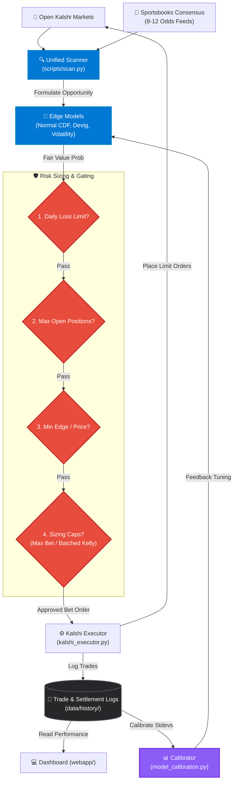

# 📖 Edge-Radar Documentation

  
  
  
  

Welcome to the central documentation index for **Edge-Radar**. This index organizes the setup manuals, strategy guides, system architecture definitions, and repository analyses.

---

## 🏗️ Pipeline & Data Flow

The diagram below outlines how the Edge-Radar pipeline runs dynamically, from market scanning to execution and post-hoc calibration:

---

## 🗺️ Documentation Directory

### 🚀 Setup & Automation
*   [SETUP_GUIDE.md](./setup/SETUP_GUIDE.md) — Step-by-step instructions to configure API keys, venv, and RSA private credentials.
*   [AUTOMATION_GUIDE.md](./setup/AUTOMATION_GUIDE.md) — Setting up the automated scanners and schedulers.
*   [task-schedules.md](./setup/task-schedules.md) — Reference for Windows Task Scheduler cron entries.

### 🧠 Edge Models & Market Guides
*   [SPORTS_GUIDE.md](./kalshi/kalshi-sports-betting/SPORTS_GUIDE.md) — Sports betting edge model: weighted de-vig consensus, CDF spreads/totals, and sportsbook weighting tiers.
*   [MLB_FILTERING_GUIDE.md](./kalshi/kalshi-sports-betting/MLB_FILTERING_GUIDE.md) — Detailed pitcher/matchup and weather filtering for baseball wagers.
*   [FUTURES_GUIDE.md](./kalshi/kalshi-futures-betting/FUTURES_GUIDE.md) — Championship and division futures de-vigging models.
*   [PREDICTION_MARKETS_GUIDE.md](./kalshi/kalshi-prediction-betting/PREDICTION_MARKETS_GUIDE.md) — Scanners for Weather (NWS), Crypto (CoinGecko), and S&P 500 options.

### ⚙️ Architecture & CLI References
*   [ARCHITECTURE.md](./ARCHITECTURE.md) — In-depth overview of the 7-stage pipeline, Kelly sizing equations, and risk gating conditions.
*   [SCRIPTS_REFERENCE.md](./SCRIPTS_REFERENCE.md) — Complete CLI reference list of all script arguments, flags, and batch commands.

### 💻 Web App
*   [LOCAL.md](./web-app/LOCAL.md) — Running the local Streamlit dashboard web interface.
*   [CLOUD.md](./web-app/CLOUD.md) — Streamlit Cloud deployment guide.

### 📈 Reports & Analysis
*   [ROADMAP.md](./enhancements/ROADMAP.md) — Priorities, consolidated action items, and completed milestones history.
*   [CHANGELOG.md](./CHANGELOG.md) — Project commit and feature changelog history.
*   [analysis-6_23_26.md](./my-documents/repo-analysis/analysis-6_23_26.md) — 90-day comprehensive performance audit and logic recommendations.
*   [analysis-5_2_26.md](./my-documents/repo-analysis/analysis-5_2_26.md) — Legacy codebase audit.

---

> [!NOTE]
> All automated scheduler files and execution paths in this repository are designed for Windows 11 using PowerShell (`pwsh`) and Command Prompt (`cmd`) scripts.

  Built with <a href="https://modelcontextprotocol.io">MCP</a> · <a href="https://streamlit.io">Streamlit</a> · <a href="https://kalshi.com">Kalshi API</a>

