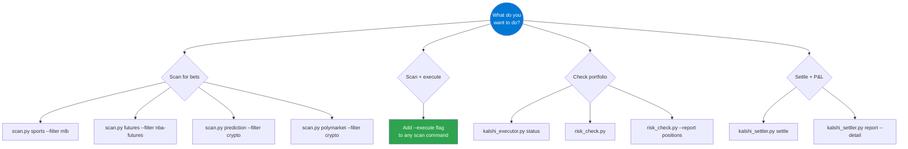
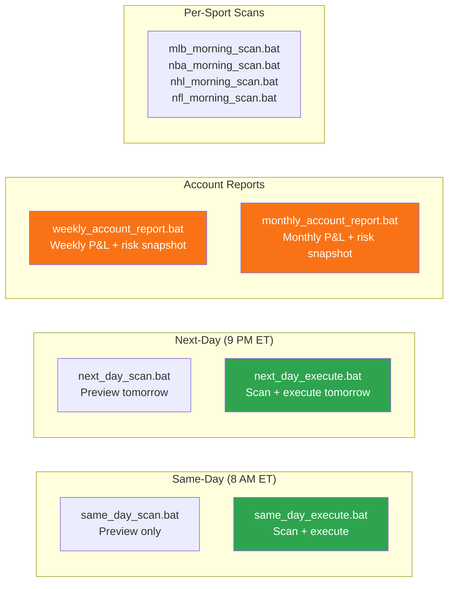

# Scripts Reference

**Every Script, Flag & Example in Edge-Radar**

[](#-scanners)
[](#-execution--portfolio)
[](#-utility-scripts)
[](#-automated-execution)

For domain-specific guides: **[Sports](kalshi-sports-betting/SPORTS_GUIDE.md)** · **[Futures](kalshi-futures-betting/FUTURES_GUIDE.md)** · **[Predictions](kalshi-prediction-betting/PREDICTION_MARKETS_GUIDE.md)** · **[Architecture](ARCHITECTURE.md)** · **[Roadmap](enhancements/ROADMAP.md)**

---

## 🗺️ Which Script Should I Use?



| Goal | Command | Details |
| :--- | :--- | :--- |
| **Scan for sports bets** | `scan.py sports --filter mlb` | [edge_detector.md](scripts/edge_detector.md) |
| **Scan championship futures** | `scan.py futures --filter nba-futures` | [futures_edge.md](scripts/futures_edge.md) |
| **Scan prediction markets** | `scan.py prediction --filter crypto` | [prediction_scanner.md](scripts/prediction_scanner.md) |
| **Cross-reference Polymarket** | `scan.py polymarket --filter crypto` | [polymarket_edge.md](scripts/polymarket_edge.md) |
| **Scan AND execute** | Add `--execute` to any scan | Orders placed through risk pipeline |
| **Quick portfolio status** | `kalshi_executor.py status` | [kalshi_executor.md](scripts/kalshi_executor.md) |
| **Full risk dashboard** | `risk_check.py` | [risk_check.md](scripts/risk_check.md) |
| **Settle bets + P&L** | `kalshi_settler.py settle` then `report` | [kalshi_settler.md](scripts/kalshi_settler.md) |

> [!IMPORTANT]
> Every scan defaults to **preview mode**. No money is risked until you pass `--execute`.

---

## 🔍 scan.py — Unified Scanner

**Location:** `scripts/scan.py`

Single entry point for all scanners. Routes to the correct scanner based on market type. All flags are forwarded directly.

```bash
python scripts/scan.py <market-type> [flags]
```

| Market Type | Aliases | Routes To |
| :--- | :--- | :--- |
| `sports` | `sport` | `edge_detector.py scan` |
| `futures` | — | `futures_edge.py scan` |
| `prediction` | `pred` | `prediction_scanner.py scan` |
| `polymarket` | `poly`, `xref` | `polymarket_edge.py scan` |

### Common Flags

| Flag | Default | Description |
| :--- | :--- | :--- |
| `--filter X` | *(none)* | Filter by sport/asset/category (e.g., `mlb`, `nba`, `crypto`, `weather`) |
| `--min-edge N` | `0.03` | Minimum edge threshold to surface an opportunity |
| `--top N` | `20` | Number of top opportunities to display |
| `--date X` | *(all dates)* | Filter by game date (`today`, `tomorrow`, `YYYY-MM-DD`, `mar31`) |
| `--save` | off | Save a markdown report to `reports/` |
| `--exclude-open` | off | Skip markets where you already have an open position |
| `--execute` | off | Execute bets through the pipeline (dry run without this) |
| `--unit-size N` | `UNIT_SIZE` env | Dollar amount per bet |
| `--max-bets N` | `5` | Maximum number of bets to place |
| `--budget X` | *(none)* | Max total batch cost — percentage (`10%`) or dollars (`15`) |
| `--max-per-game N` | `2` | Max positions per game/event |
| `--pick X` | *(all)* | Comma-separated row numbers to execute (e.g., `'1,3,5'`) |
| `--ticker X` | *(all)* | Execute only specific tickers |
| `--category X` | *(all)* | Market category: `game`, `spread`, `total`, `player_prop`, `esports`, `other` |
| `--report-dir X` | *(auto)* | Override report output directory for `--save` |

> [!TIP]
> The `scan` subcommand is auto-inserted if omitted. Some scanners accept additional flags (e.g., `--cross-ref` for polymarket). Run `<market-type> --help` for the full flag list.

### Examples

```bash
python scripts/scan.py sports --filter mlb --date today --save
python scripts/scan.py sports --filter nba --category total --date tomorrow
python scripts/scan.py futures --filter nba-futures --top 10
python scripts/scan.py prediction --filter crypto --cross-ref
python scripts/scan.py polymarket --filter crypto --min-edge 0.05
```

---

## 📅 Daily Workflow

### Morning

```bash
# 1. Check portfolio state and open positions
python scripts/kalshi/kalshi_executor.py status

# 2. Settle any overnight results
python scripts/kalshi/kalshi_settler.py settle

# 3. Check if daily loss limit is breached
python scripts/kalshi/risk_check.py --report limits
```

### Scanning for Opportunities

```bash
# 4. Scan sports (preview only — no money risked)
python scripts/scan.py sports --filter nba
python scripts/scan.py sports --filter mlb
python scripts/scan.py sports --filter nhl

# 5. Tomorrow's games only, skip open positions
python scripts/scan.py sports --filter mlb --date tomorrow --exclude-open

# 6. Scan futures & prediction markets
python scripts/scan.py futures --filter nba-futures
python scripts/scan.py prediction --filter crypto
```

### Executing Bets

```bash
# 7. Execute top picks from a scan
python scripts/scan.py sports --filter mlb --execute --max-bets 10 --unit-size 1

# 8. Execute with a budget cap (total batch cost ≤ 10% of bankroll)
python scripts/scan.py sports --execute --max-bets 5 --budget 10% --date today --exclude-open

# 9. Cherry-pick specific rows from preview
python scripts/scan.py sports --filter nba --execute --pick '1,3,5'

# 10. Execute a specific ticker
python scripts/scan.py sports --filter nba --execute --ticker KXNBAGAME-26MAR25LALBOS-LAL
```

### End of Day

```bash
# 11. Settle completed bets
python scripts/kalshi/kalshi_settler.py settle

# 12. Generate report (console + save to file)
python scripts/kalshi/kalshi_settler.py report --detail --save

# 13. Reconcile local log vs Kalshi API
python scripts/kalshi/kalshi_settler.py reconcile
```

---

## 📋 Script Reference

Each script has a dedicated doc with full flag tables, examples, methodology, and output format.

### 🎯 Scanners

| Script | Purpose | Docs |
| :--- | :--- | :--- |
| `edge_detector.py` | Sports edge detection (NBA, MLB, NHL, NFL, NCAA, etc.) | [edge_detector.md](scripts/edge_detector.md) |
| `futures_edge.py` | Championship & season-long futures | [futures_edge.md](scripts/futures_edge.md) |
| `prediction_scanner.py` | Crypto, weather, S&P 500, politics | [prediction_scanner.md](scripts/prediction_scanner.md) |
| `polymarket_edge.py` | Polymarket cross-reference edge | [polymarket_edge.md](scripts/polymarket_edge.md) |

### 💼 Execution & Portfolio

| Script | Purpose | Docs |
| :--- | :--- | :--- |
| `kalshi_executor.py` | Portfolio status + execution library | [kalshi_executor.md](scripts/kalshi_executor.md) |
| `kalshi_settler.py` | Settlement, P&L reporting, reconciliation | [kalshi_settler.md](scripts/kalshi_settler.md) |
| `risk_check.py` | Portfolio risk dashboard & limits gating | [risk_check.md](scripts/risk_check.md) |

---

## 🔧 Utility Scripts

<details>
<summary><b>kalshi_client.py — API Client CLI</b></summary>

**Location:** `scripts/kalshi/kalshi_client.py`

Low-level API queries for debugging and checking raw market data.

```bash
python scripts/kalshi/kalshi_client.py COMMAND [flags]
```

| Command | Description |
| :--- | :--- |
| `balance` | Show account balance |
| `markets` | List open markets |
| `positions` | Show open positions |
| `orders` | Show order history |
| `market` | Get details for a single market (requires `--ticker`) |

| Flag | Default | Description |
| :--- | :--- | :--- |
| `--ticker TICKER` | *(none)* | Market ticker (for `market` command) |
| `--limit N` | `20` | Number of results |
| `--status STATUS` | `open` | Market status filter |

</details>

<details>
<summary><b>fetch_odds.py — Odds API Explorer</b></summary>

**Location:** `scripts/kalshi/fetch_odds.py`

Explore raw sportsbook odds without running edge detection.

```bash
python scripts/kalshi/fetch_odds.py [flags]
```

| Flag | Default | Description |
| :--- | :--- | :--- |
| `--market SPORT` | `nba` | `nba`, `nfl`, `mlb`, `nhl`, `ncaafb`, `ncaabb`, `soccer`, `mma`, `all` |
| `--min-edge N` | from .env | Minimum edge threshold |
| `--dry-run` | off | Print results without saving |
| `--save` | off | Save opportunities to watchlist |

</details>

<details>
<summary><b>fetch_market_data.py — Market Data Fetcher</b></summary>

**Location:** `scripts/kalshi/fetch_market_data.py`

Pull market data for stocks, crypto, or prediction markets.

```bash
python scripts/kalshi/fetch_market_data.py [flags]
```

| Flag | Default | Description |
| :--- | :--- | :--- |
| `--type TYPE` | `stocks` | `stocks`, `prediction`, `crypto`, `account`, `all` |
| `--symbols SYM [SYM ...]` | `AAPL NVDA TSLA SPY QQQ` | Tickers to fetch |
| `--limit N` | `20` | Number of prediction market results |
| `--save` | off | Save snapshot to data/ |
| `--source SOURCE` | `polymarket` | `polymarket` or `kalshi` |

</details>

<details>
<summary><b>daily_sports_scan.py — Daily Morning Report</b></summary>

**Location:** `scripts/schedulers/automation/daily_sports_scan.py`

Generate a morning edge report scanning MLB, NBA, NHL, and NFL.

```bash
python scripts/schedulers/automation/daily_sports_scan.py [flags]
```

| Flag | Default | Description |
| :--- | :--- | :--- |
| `--top N` | `25` | Number of top opportunities to include |
| `--daemon` | off | Run as background daemon — scans at 8:00 AM PST daily |

**Output:** Report saved to `reports/Sports/daily_edge_reports/YYYY-MM-DD_morning_scan.md`

</details>

<details>
<summary><b>install_windows_task.py — Windows Task Scheduler Setup</b></summary>

**Location:** `scripts/schedulers/automation/install_windows_task.py`

```bash
python scripts/schedulers/automation/install_windows_task.py install   # Create the task
python scripts/schedulers/automation/install_windows_task.py status    # Check if installed
python scripts/schedulers/automation/install_windows_task.py run       # Trigger now (test)
python scripts/schedulers/automation/install_windows_task.py remove    # Remove the task
```

</details>

---

## 🤖 Automated Execution

Pre-built `.bat` scripts that scan all major sports in a single command and execute the top picks ranked by composite score.



### Same-Day (Primary — 8 AM ET)

| Script | Action |
| :--- | :--- |
| `same_day_scan.bat` | Preview only — saves execution report, no bets |
| `same_day_execute.bat` | Scan + execute — places live orders |

> [!TIP]
> Best time: **8 AM ET**. All markets posted, sportsbook lines sharp overnight, Kalshi lag window open.

### Next-Day (Reserve — 9 PM ET)

| Script | Action |
| :--- | :--- |
| `next_day_scan.bat` | Preview tomorrow's games |
| `next_day_execute.bat` | Scan + execute tomorrow's games |

> [!NOTE]
> Use when you want to lock in early lines the night before. Tomorrow's markets may not all be posted yet.

### Account Reports

| Script | Schedule | Action |
| :--- | :--- | :--- |
| `weekly_account_report.bat` | Every Monday 9 AM ET | Settle → 7-day P&L detail → risk snapshot |
| `monthly_account_report.bat` | 1st of month 9 AM ET | Settle → 30-day P&L detail → risk snapshot |

### Shared Configuration

All execution scripts use:
- `--unit-size .5` — Kelly sizes up from there for high-edge bets
- `--max-bets 10` — total across all sports
- `--exclude-open` — skip markets with existing positions
- `--save` — execution report (Sport, Bet, Type, Pick, Qty, Price, Cost, Edge)
- All 9 risk gates enforced

---

## ⏰ Scheduling Your Own Scans

For recurring scans, use Windows Task Scheduler with the pre-built `.bat` scripts or `scan.py` directly.

```bash
# Same-day automated execution at 8 AM (recommended)
scripts\schedulers\same_day_executions\same_day_execute.bat

# Or build your own with scan.py
python scripts/scan.py sports --unit-size 1 --max-bets 10 --date today --exclude-open --save --execute

# Settle results at 11 PM
python scripts/kalshi/kalshi_settler.py settle
python scripts/kalshi/kalshi_settler.py report --detail --save
```

<details>
<summary><b>Windows Task Scheduler Commands</b></summary>

```bash
# Same-day execution at 8 AM daily (all sports, top 10)
schtasks /Create /TN "Edge-Radar\Same-Day-Execute" /TR "D:\AI_Agents\Specialized_Agents\Edge_Radar\scripts\schedulers\same_day_executions\same_day_execute.bat" /SC DAILY /ST 08:00

# Settle results at 11 PM daily
schtasks /Create /TN "Edge-Radar\Settle" /TR "\".venv\Scripts\python.exe\" \"scripts\kalshi\kalshi_settler.py\" settle" /SC DAILY /ST 23:00

# Weekly account report every Monday at 9 AM
schtasks /Create /TN "Edge-Radar\Weekly-Report" /TR "D:\AI_Agents\Specialized_Agents\Edge_Radar\scripts\schedulers\account_reports\weekly\weekly_account_report.bat" /SC WEEKLY /D MON /ST 09:00

# Monthly account report on the 1st at 9 AM
schtasks /Create /TN "Edge-Radar\Monthly-Report" /TR "D:\AI_Agents\Specialized_Agents\Edge_Radar\scripts\schedulers\account_reports\monthly\monthly_account_report.bat" /SC MONTHLY /D 1 /ST 09:00
```

</details>

---

<p align="center">

**[← Back to README](../README.md)** · **[Architecture →](ARCHITECTURE.md)** · **[Setup Guide →](setup/SETUP_GUIDE.md)**

</p>
