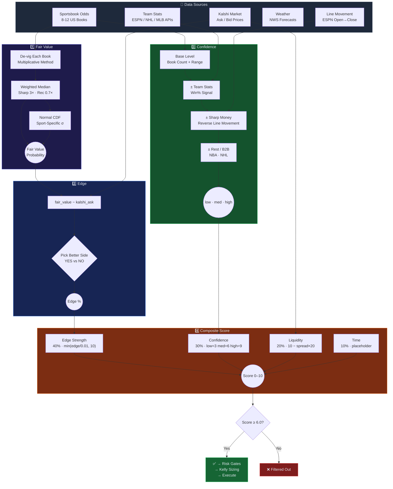

# Edge-Radar Architecture

**System Design, Edge Models, Risk Gates & Data Flow**

[](#-pipeline-overview)
[](#-edge-detection-models)
[](#%EF%B8%8F-risk-management)
[](#-how-scoring-works)
[](#-position-sizing)

---

## 🔭 System Overview

Edge-Radar is an automated edge-detection and execution pipeline for Kalshi prediction markets and sports betting. It scans thousands of open markets, cross-references prices against sportsbook consensus odds and external data models, identifies mispriced contracts, applies risk gates and position sizing, and executes limit orders — logging every decision for post-hoc calibration.

---

## 🔄 Pipeline Overview

The system processes every opportunity through seven sequential stages. Each stage either advances the opportunity or eliminates it.

| Stage | Action | Key Detail |
| :--- | :--- | :--- |
| **1. Fetch** | Pull all open Kalshi markets via API | Simultaneously fetch sportsbook odds + external data feeds |
| **2. Categorize** | Classify by type | Determines which edge model applies |
| **3. Compare** | Fair value vs. Kalshi ask price | Score on 4 dimensions: edge, confidence, liquidity, time |
| **4. Cap** | Limit to top 3 per game/event | Prevents concentration in a single contest |
| **5. Risk-Check** | 18 risk gates + Kelly sizing | Reject or cap — see [Risk Management](#%EF%B8%8F-risk-management) |
| **6. Execute** | Place limit orders on Kalshi | Full trade journal entry with rationale |
| **7. Monitor** | Track positions, settle, calibrate | Realized P&L + closing line value tracking |

---

## 🧠 Edge Detection Models

Each market type has a specialized edge model. All models produce the same output: a **fair value probability** that gets compared against the Kalshi ask price.

### Game Outcomes (Moneyline / 2-Way De-Vig)

Fetch head-to-head odds from 8-12 US sportsbooks. De-vig each book's line using the multiplicative method to extract true implied probability. Take the **weighted median** across all books — sharp books (Pinnacle, Circa) weighted 3x, recreational books (DraftKings, FanDuel) weighted 0.7x. Confidence factors in book count, estimate spread, and team stats signal.

The odds event is **opponent- and date-validated** before pricing: it must contain both of the market's teams on opposite sides *and* agree with the ticker's schedule (moneyline = embedded start time; date-only tickers = ET game date). If the specific game is absent or ambiguous, no edge is emitted. This prevents pricing a market against a different game (wrong opponent, or the wrong game of a playoff series). Soccer h2h is 3-way (home/draw/away): the "team to win?" binary uses the team's devigged win share, with draws falling to the NO side.

### Spreads (Normal CDF Model)

Fetch spread lines from sportsbooks and compute weighted median spread and implied probability. Infer expected score margin using the book's line, then model the final margin as **Normal(mean, stdev)** with sport-specific standard deviations. Calculate `P(margin > strike)` via normal CDF.

| Sport | Base Stdev | Notes |
| :--- | :--- | :--- |
| NBA | 12 | Higher variance, blowouts common |
| NCAAB | 11 | Similar to NBA, slightly tighter |
| NFL | 13.5 | Highest variance — field goals, turnovers |
| MLB | 3.5 | Low scoring, tight games |
| NHL | 2.5 | Lowest variance sport |

**Dynamic stdev adjustments** are compounded on top of the base value. Rest/B2B status and weather conditions each contribute an additive adjustment, widening the distribution when uncertainty is higher. See the weather adjustment table below for stdev values.

### Totals (Normal CDF + Weather)

Same CDF approach as spreads for expected total. For NFL and MLB outdoor games, a **weather adjustment** is applied via NWS hourly forecasts. Weather affects both fair value (scoring shift) and stdev (uncertainty):

| Condition | Fair Value Shift | Stdev Adjustment |
| :--- | :--- | :--- |
| Wind > 15 mph | Over fair value decreased | +0.1 to +0.5 (by severity) |
| Rain > 40% | Over fair value decreased | +0.1 to +0.5 (by severity) |
| Extreme cold | Over fair value decreased | +0.1 to +0.5 (by severity) |
| Dome stadium | No weather effect | 0.0 (auto-excluded) |

**Stdev severity tiers:** severe = +0.5, moderate = +0.3, mild = +0.1, none = 0.0. For totals, pitcher rest and rest/B2B adjustments are also compounded into the stdev alongside weather.

### Futures (N-Way De-Vig)

For championship and season-long markets with N outcomes, de-vig the full N-way market from sportsbook futures odds. Distribute the overround proportionally. Take weighted median across books.

### Predictions (Model-Specific)

| Market Type | Data Source | Method |
| :--- | :--- | :--- |
| Crypto (BTC, ETH, XRP, DOGE, SOL) | CoinGecko | Current price + 24h volatility vs. Kalshi strike; log-normal distribution |
| Weather (13 US cities) | NWS / NOAA | Ensemble forecast temperature distributions vs. Kalshi strike thresholds |
| S&P 500 | Yahoo Finance + VIX | Current level + implied volatility → probability of reaching strike by expiry |

---

## 📐 How Scoring Works

Four independent attributes are calculated for every opportunity. They build on each other but are derived from different data sources.



### Fair Value

The model's estimate of the true probability, derived purely from sportsbook odds:

1. Fetch odds from 8-12 US sportsbooks
2. De-vig each book's line (multiplicative method)
3. Take **weighted median** — sharp books 3x, recreational books 0.7x
4. For spreads/totals: apply **normal CDF** with sport-specific stdev

### Edge

How mispriced the Kalshi contract is — pure math, no judgment:

```
edge = fair_value - kalshi_ask_price
```

> [!TIP]
> A positive edge means Kalshi is underpricing the outcome relative to sportsbook consensus. Example: fair value = $0.74, Kalshi asks $0.61 → edge = **+13.3%**

### Confidence

How much to trust the fair value estimate. Derived from **data quality**, not edge size. A 30% edge with low confidence may be stale data; a 3% edge with high confidence is a real, durable signal.

**Base confidence** (from book consensus):

| Market Type | Low | Medium | High |
| :--- | :--- | :--- | :--- |
| Game (ML) | < 5 books | 5+ books | 8+ books AND fair range < 5% |
| Spread | < 3 books OR range > 4pts | 3+ books AND range ≤ 4pts | 6+ books AND range ≤ 2pts |
| Total | < 3 books | 3+ books | (via adjustments only) |

**Adjustments** — since R13 (2026-04-24) these are **one-way**: a contradicting signal drops one tier, but a supporting signal is a no-op (upward bumps tracked inflated claimed edge, not better outcomes):
- **Team stats** — win%, L10, home/away from ESPN/NHL/MLB APIs; contradicting stats drop a tier
- **Sharp money / line movement** — ESPN open-vs-close odds; reverse line movement *against* our bet drops a tier

### Score (Composite)

The final ranking — a single 0-10 number combining all signals:

| Component | Weight | Formula |
| :--- | :--- | :--- |
| Edge strength | 40% | `min(edge / 0.01, 10)` — linear, caps at 10% edge |
| Confidence | 30% | low = 3, medium = 6, high = 9 |
| Liquidity | 20% | `10 - (bid_ask_spread * 20)` — tighter = higher |
| Time | 10% | Fixed at 5 (placeholder) |

<details>
<summary><b>Scoring Example</b></summary>

A bet with 8% edge, high confidence, and tight spread:

| Component | Value | Weighted |
| :--- | :--- | :--- |
| Edge | min(8, 10) | × 0.40 = **3.2** |
| Confidence | 9 (high) | × 0.30 = **2.7** |
| Liquidity | 9.0 | × 0.20 = **1.8** |
| Time | 5 | × 0.10 = **0.5** |
| **Total** | | **8.2** |

The minimum score to pass risk checks is **6.0** (configurable via `MIN_COMPOSITE_SCORE`).

</details>

---

## 🛡️ Risk Management

### Risk Gate Pipeline

Every order must pass gates 1-7 (including 2b, 3.5, 3.6, 3.7, 4.5, 4.6, 4.6b, 4.7 and 4.8) before execution. Gates 8-9 are sizing caps that downsize the order rather than rejecting it. **Gate 2b does both** — it rejects when a ceiling is already breached and caps otherwise.

| | Gate | Check | Behavior |
| :--- | :--- | :--- | :--- |
| 1 | **Daily loss limit** | Sum of realized losses today | **Reject** if losses ≥ `MAX_DAILY_LOSS` |
| 2 | **Position count** | Number of open positions | **Reject** if count ≥ `MAX_OPEN_POSITIONS` |
| 2b | **Cumulative exposure (S4)** | Total open at-risk dollars, and the row's own sport, against **equity** (cash + position value) | **Reject** if already ≥ `MAX_OPEN_EXPOSURE_PCT` or ≥ `MAX_SEGMENT_EXPOSURE_PCT`; otherwise **Cap** to the remaining headroom. The only gate that measures a standing total. |
| 3 | **Edge threshold** | Calculated edge, **plus the exchange fee** (F1) | **Reject** if edge < per-sport floor (or `MIN_EDGE_THRESHOLD` global fallback). A floor ≥ 1.0 is unreachable and means the sport is **off** — reported as `sport_disabled`. |
| 3.5 | **Market price floor (R7)** | Contract ask price | **Reject** if price < `MIN_MARKET_PRICE` (lottery-ticket filter, no edge/confidence exception) |
| 3.6 | **Liquidity floor (L2)** | Bid/ask spread and trailing-24h volume | **Reject** if spread > `MAX_BID_ASK_SPREAD` or volume < `MIN_MARKET_VOLUME_24H`. Fails open on a missing book. |
| 3.7 | **Time to event (S5)** | Days from now to a **game's** date | **Reject** if > `MAX_DAYS_TO_EVENT_FOR_GAME_MARKETS`. **Futures exempt by category.** Fails open on an unparseable date. |
| 4 | **Composite score** | Weighted score (edge + confidence + liquidity + time) | **Reject** if score < `MIN_COMPOSITE_SCORE` |
| 4.5 | **Min confidence (R3)** | Opportunity confidence label (low/medium/high) | **Reject** if confidence below `MIN_CONFIDENCE` |
| 4.6 | **NO-side favorite guard (R1)** | NO bet on a heavy favorite (price < `NO_SIDE_FAVORITE_THRESHOLD`) | **Reject** unless edge ≥ `NO_SIDE_MIN_EDGE` AND confidence=high |
| 4.6b | **NO-side global floor (R28)** | Any NO bet | **Reject** if edge < max(per-sport floor, `NO_SIDE_MIN_EDGE_GLOBAL`) |
| 4.7 | **Prediction-market safety (R25)** | Category in `{crypto, weather, spx, mentions, companies, politics}` | **Reject** unless `ALLOW_PREDICTION_BETS=true` |
| 4.8 | **Live/in-play safety (L1)** | Game already started (`is_game_started`) | **Reject** unless `ALLOW_LIVE_BETS=true` |
| 5 | **Duplicate ticker** | Already holding this exact market | **Reject** if ticker in open positions |
| 6 | **Per-event cap** | Too many positions on the same game | **Reject** if event count ≥ `MAX_PER_EVENT` |
| 7 | **Series dedup** | Same matchup bet on a recent date (sport + team pair) | **Reject** if matchup key appears in trade log within `SERIES_DEDUP_HOURS` (per-sport override via `SERIES_DEDUP_HOURS_<SPORT>` — MLB/NHL default to 72h, others 48h — R9, 2026-04-27) |
| 8 | **Max bet size** | Bet exceeds max size | **Cap** — downsize to `MAX_BET_SIZE` |
| 9 | **Bet ratio cap** | Single bet cost vs. median batch cost | **Cap** — downsize so cost ≤ `MAX_BET_RATIO` × median batch cost |

**Scope, in one line each.** Gates 1 and 2b measure the *account*; 2, 5, 6 and 7 measure the
*book*; 3 through 4.8 measure the *opportunity*; 8, 9 and 2b's cap measure the *order*. Until
S4 shipped on 2026-08-26 nothing in the chain measured total capital deployed, which is how 26
NFL positions reached 31% of bankroll with every other gate passing the whole way.

In addition, NO bets priced below `NO_SIDE_KELLY_PRICE_FLOOR` (default $0.35) are sized at `NO_SIDE_KELLY_MULTIPLIER` of normal Kelly (default half-Kelly). This is a sizing dampener, not a reject gate — it runs inside the Kelly calculation for NO bets that cleared gate 4.6.

> [!NOTE]
> The trade log records approval subtypes for post-trade review:
> - `APPROVED` — passed all gates, no caps hit
> - `APPROVED_CAPPED_MAX_BET` — downsized by gate 8
> - `APPROVED_CAPPED_BET_RATIO` — downsized by gate 9
> - `APPROVED_CAPPED_EXPOSURE` — downsized by gate 2b's remaining headroom
> - `APPROVED_BUMPED_MIN_SHARES` — raised to a venue's minimum order size (Polymarket US)

### Risk Parameters

| Env Variable | Default | Description |
| :--- | :--- | :--- |
| `UNIT_SIZE` | $1.00 | Minimum dollar amount per bet (Kelly floor) |
| `KELLY_FRACTION` | 0.25 | Quarter-Kelly sizing multiplier |
| `MAX_BET_SIZE` | $100 | Maximum USD per bet (sports and prediction) |
| `MAX_DAILY_LOSS` | $250 | Hard stop — no new positions after this daily loss |
| `MAX_OPEN_POSITIONS` | 50 | Maximum concurrent open positions — counts *rows*, not dollars |
| `MAX_OPEN_EXPOSURE_PCT` | 0 (off) | Gate 2b: total open at-risk / equity. Live `.env`: 0.50 |
| `MAX_SEGMENT_EXPOSURE_PCT` | 0 (off) | Gate 2b: same, per sport (falls back to category). Live `.env`: 0.33 |
| `MAX_DAYS_TO_EVENT_FOR_GAME_MARKETS` | 0 (off) | Gate 3.7: max days from now to a **game's** date; futures exempt. Live `.env`: 14 |
| `MAX_PER_EVENT` | 2 | Maximum positions on the same game/event |
| `MIN_EDGE_THRESHOLD` | 3% | Global minimum edge required to consider a bet |
| `MIN_EDGE_THRESHOLD_<SPORT>` | (optional) | Per-sport override of the global floor (e.g., `MIN_EDGE_THRESHOLD_MLB=0.04`). Live: MLB/NBA/NCAAB=0.04 (2026-06-14). Supported: MLB, NBA, NHL, NFL, NCAAB, NCAAF, MLS, SOCCER |
| `MIN_MARKET_PRICE` | $0.12 | Gate 3.5 (R7): reject bets priced below this. Hard floor with no edge/confidence exception. Set to 0 to disable and keep all longshots. |
| `MIN_COMPOSITE_SCORE` | 6.0 | Minimum composite opportunity score |
| `MIN_CONFIDENCE` | medium | Reject below this confidence label (low/medium/high) — Gate 4.5 |
| `NO_SIDE_FAVORITE_THRESHOLD` | 0.25 | Gate 4.6: NO bets below this price need elevated edge + confidence |
| `NO_SIDE_MIN_EDGE` | 0.25 | Gate 4.6: minimum edge for a NO bet below the threshold (plus confidence=high) |
| `NO_SIDE_KELLY_PRICE_FLOOR` | 0.35 | Below this NO-side price, Kelly sizing is dampened |
| `NO_SIDE_KELLY_MULTIPLIER` | 0.5 | Kelly multiplier applied to NO bets priced below the floor (half-Kelly) |
| `MAX_BET_RATIO` | 3.0 | Max ratio of any single bet cost to median batch cost |
| `KELLY_EDGE_CAP` | 0.15 | Soft-cap on edge used for Kelly sizing (raw edge unchanged elsewhere) |
| `KELLY_EDGE_DECAY` | 0.5 | Decay factor for edge above the cap |
| `SERIES_DEDUP_HOURS` | 48 | Global default: reject bet if same matchup was bet within this window (0 disables) |
| `SERIES_DEDUP_HOURS_<SPORT>` | (optional) | R9 (2026-04-27): per-sport override. Live: `SERIES_DEDUP_HOURS_MLB=72`, `SERIES_DEDUP_HOURS_NHL=72`. Sports without an override fall back to the global. Per-sport `0` disables the gate just for that sport. |
| `ALLOW_PREDICTION_BETS` | false | Gate 4.7 (R25): when false, reject all crypto/weather/spx/mentions/companies/politics bets. Default off until the prediction-market models are rebuilt (see R25b/R25c). |

---

## 💰 Position Sizing

Bets are sized using **batch-aware Kelly with a flat unit floor**. Kelly only scales up for high-edge opportunities — it never sizes below the minimum unit.

```
bet = max(unit_size, (KELLY_FRACTION / batch_size) × trusted_edge × bankroll)
```

`trusted_edge` is the raw edge passed through a soft-cap: edges at or below `KELLY_EDGE_CAP` (default 15%) are used as-is; the portion above is multiplied by `KELLY_EDGE_DECAY` (default 0.5). So a claimed 25% edge sizes like 20%, a 35% edge like 25%. This damps Kelly sizing on extreme-edge bets that post-baseline calibration showed are the worst-calibrated — without eliminating them. Raw edge remains visible in reports, rationales, and the `MIN_EDGE_THRESHOLD` gate.

When placing N bets simultaneously, each bet's Kelly fraction is divided by N. Total batch exposure stays proportional to what a single full-fraction bet would allocate.

| Ask Price | Edge | Flat Contracts | Kelly Contracts | Used | Actual Cost |
| :--- | :--- | :--- | :--- | :--- | :--- |
| $0.50 | 3% | 2 | 1 | 2 (flat) | $1.00 |
| $0.50 | 15% | 2 | 4 | 4 (Kelly) | $2.00 |
| $0.10 | 10% | 10 | 13 | 13 (Kelly) | $1.30 |
| $0.02 | 5% | 50 | 31 | 50 (flat) | $1.00 |

The result is capped by (in order): max bet size ($100), bet ratio cap, and available bankroll. `KELLY_FRACTION` is configurable in `.env` (default: 0.25).

### Budget Cap (Batch-Level)

An optional `--budget` flag caps the **total cost of all bets in a batch**. When the sum exceeds the budget, bets are scaled down while preserving Kelly's edge-weighting — higher-edge bets retain proportionally more capital. Each bet keeps at least 1 contract.

The budget is a **fixed pool**, so sizing one class of bet up necessarily takes capital from the others. Since C11b (2026-07-27) the cap therefore:

1. **never shaves a bet below its flat unit floor** `round(unit_size / price)` — that floor encodes "if we are betting this at all, bet at least `unit_size`", and the old proportional pass silently overrode it (an 18¢ leg fell from 6 contracts to 2 once corrected Kelly let favorites consume the pool);
2. **bisects for the largest feasible scale** instead of taking one proportional pass, so it packs the budget properly rather than undershooting;
3. **drops whole orders — lowest composite score first — only when the floors alone cannot fit.** Shaving legs that still sit above their floor always comes first, so a few cents of overage can never delete a position.

```bash
# Cap total batch cost to 10% of bankroll
python scripts/scan.py sports --unit-size 1 --max-bets 5 --budget 10% --date today --exclude-open
```

> [!TIP]
> The budget accepts a percentage of bankroll (e.g., `--budget 10%`) or a flat dollar amount (e.g., `--budget 15`). When omitted, the pipeline behaves exactly as before. When the total is already under the budget, no scaling occurs.

---

## 📂 Data Flow

| File Path | Contents |
| :--- | :--- |
| `data/history/kalshi_trades.json` | Complete trade log: edge estimate, sizing, fill price, fees, status |
| `data/history/kalshi_settlements.json` | Settlement history with outcome, realized P&L, edge calibration. Self-describing schema as of R5 (2026-04-27): also carries `composite_score`, `risk_approval`, `bankroll_pct`, `closing_price`, `clv`, `category`, `title`, `unit_size`, `fill_status`. |
| `data/history/README.md` | Documents the trade-log/settlement schema lifecycle and the pre-R5 historical-orphan cohort. Run `python scripts/kalshi/risk_check.py --report reconciliation` to audit the join health. |
| `data/watchlists/kalshi_opportunities.json` | Latest scored opportunities from the edge detector |
| `data/positions/open_positions.json` | Snapshot of current open positions |
| `data/finagent.db` | SQLite database (schema defined in `scripts/sql/init_db.sql`) |

---

## 🔮 Remaining Work

For the full enhancement roadmap (completed and pending items), see [ROADMAP.md](../ROADMAP.md).

| Priority | Enhancement | Status |
| :--- | :--- | :--- |
| ✅ Done | Backtesting framework — equity curve, Sharpe, drawdown, signal breakdowns, strategy simulation | 2026-04-07 |
| 🟠 Medium | Bullpen availability tracker — high-value for MLB totals | Planned |
| 🟡 Normal | Injury impact scoring — ESPN injury reports, star player adjustments | Planned |
| 🟡 Normal | Wind direction classification — NWS bearing relative to stadium orientation | Planned |
| ✅ Done | Dynamic stdev adjustment — weather/rest/pitcher compound stdev in CDF model | 2026-04-06 |

---

## 📁 Project Structure

```
Edge-Radar/
├── .claude/                           # Claude Code config (skills, commands, settings)
│   ├── commands/                      # Slash-command definitions
│   ├── html/                          # Rendered interactive data-flow diagram
│   ├── images/                        # Logos and README assets
│   └── skills/                        # /edge-radar, /edge-radar-analysis
├── .devcontainer/                     # VS Code dev container spec
├── .github/
│   └── workflows/                     # CI/CD + GitHub Pages deploy
├── app/
│   └── domain/                        # Typed domain objects (Opportunity, RiskDecision, Execution*)
├── docs/                              # All public documentation
│   ├── kalshi/                        # Kalshi domain guides (grouped)
│   │   ├── kalshi-futures-betting/    # Championship futures guide
│   │   ├── kalshi-prediction-betting/ # Crypto, weather, S&P guides
│   │   └── kalshi-sports-betting/     # 27 sport filters, MLB filtering, sports guide
│   ├── ROADMAP.md                     # Enhancement roadmap (docs root)
│   ├── scripts/                       # Per-script detailed docs
│   ├── setup/                         # SETUP_GUIDE.md, AUTOMATION_GUIDE.md, mcp-servers.md
├── prompts/                           # LLM prompts for analysis agents
│   ├── futures/
│   ├── portfolio/
│   ├── predictions/
│   └── sports-betting/
├── scripts/
│   ├── backtest/                      # Equity curve, calibration, strategy simulation
│   ├── kalshi/                        # Scan → Size → Execute → Settle pipeline
│   ├── prediction/                    # Crypto, weather, S&P 500 scanners
│   ├── shared/                        # Team stats, weather, tickers, logging, odds API
│   ├── scan.py                        # Unified entry point (routes to each scanner)
│   ├── doctor.py                      # Environment & credentials validator
│   └── bootstrap.py                   # Import-path setup for the venv .pth file
├── tests/                             # 150+ pytest tests (domain, edge detection, fills, risk)
    └── views/                         # scan_page, portfolio_page, settle_page, backtest_page, config_page
```

<sub>Gitignored at the root (auto-created where needed): <code>data/</code> (trade history), <code>logs/</code>, <code>reports/</code> (scan + P&L reports), <code>keys/</code> (RSA private keys), <code>.venv/</code>, <code>repos/</code>.</sub>

---

<p align="center">

**[← Back to Docs Index](../README.md)** · **[Scripts Reference →](../scripts/SCRIPTS_REFERENCE.md)** · **[Setup Guide →](SETUP_GUIDE.md)**

</p>
