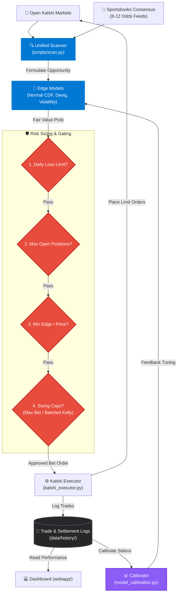

# 🏗️ Pipeline & Data Flow

The diagram below outlines how the Edge-Radar pipeline runs dynamically, from market scanning to execution and post-hoc calibration:

```mermaid
flowchart TD
    %% Nodes definition
    Markets["📡 Open Kalshi Markets"]
    Consensus["🏀 Sportsbooks Consensus\n(8-12 Odds Feeds)"]
    Models["🧠 Edge Models\n(Normal CDF, Devig, Volatility)"]
    
    Scan["🔍 Unified Scanner\n(scripts/scan.py)"]
    
    subgraph SIZING_GATING ["🛡️ Risk Sizing & Gating"]
        G1{"1. Daily Loss Limit?"}
        G2{"2. Max Open Positions?"}
        G3{"3. Min Edge / Price?"}
        G4{"4. Sizing Caps?\n(Max Bet / Batched Kelly)"}
    end
    
    Executor["⚙️ Kalshi Executor\n(kalshi_executor.py)"]
    DB[("💾 Trade & Settlement Logs\n(data/history/)")]
    
    WebUI["💻 Dashboard (webapp/)"]
    Calib["📊 Calibrator\n(model_calibration.py)"]

    %% Connections
    Markets & Consensus --> Scan
    Scan -->|Formulate Opportunity| Models
    Models -->|Fair Value Prob| G1
    G1 -- "Pass" --> G2
    G2 -- "Pass" --> G3
    G3 -- "Pass" --> G4
    G4 -->|Approved Bet Order| Executor
    
    Executor -->|Place Limit Orders| Markets
    Executor -->|Log Trades| DB
    
    DB -->|Read Performance| WebUI
    DB -->|Calibrate Stdevs| Calib
    Calib -->|Feedback Tuning| Models

    %% Styles
    classDef primary fill:#0078d4,stroke:#0284c7,stroke-width:2px,color:#fff;
    classDef secondary fill:#e74c3c,stroke:#b91c1c,stroke-width:2px,color:#fff;
    classDef storage fill:#27272a,stroke:#52525b,stroke-width:2px,color:#fff;
    classDef highlight fill:#8b5cf6,stroke:#6d28d9,stroke-width:2px,color:#fff;
    
    class Scan,Models primary;
    class G1,G2,G3,G4 secondary;
    class DB storage;
    class Calib highlight;
```
